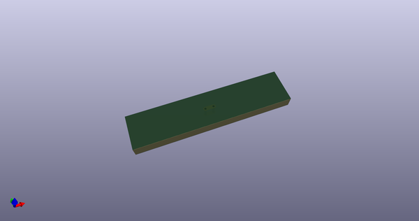
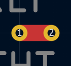
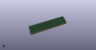

# OOMP Footprint  
## NetTie-2_THT_Pad0.3mm  by none  
  
oomp key: oomp_kicad_nettie_nettie_2_tht_pad0_3mm  
  
source repo at: [http://gitlab.com/kicad/libraries/kicad-footprints//blob/master/tmp/libraries/kicad-footprints/Varistor.pretty/RV_Rect_V25S440P_L26.5mm_W8.2mm_P12.7mm.kicad_mod](http://gitlab.com/kicad/libraries/kicad-footprints//blob/master/tmp/libraries/kicad-footprints/Varistor.pretty/RV_Rect_V25S440P_L26.5mm_W8.2mm_P12.7mm.kicad_mod)  
## Footprint  
  
  
  
  
| name | value | 
| --- | --- | 
| footprint name | NetTie-2_THT_Pad0.3mm | 
| footprint description | Net tie, 2 pin, 0.3mm round THT pads | 
| number of pads | 2 | 
| github path | http://github.com/kicad/libraries/kicad-footprints//blob/master/tmp/libraries/kicad-footprints/NetTie.pretty/NetTie-2_THT_Pad0.3mm.kicad_mod | 
| oomp key | oomp_kicad_nettie_nettie_2_tht_pad0_3mm | 
| oomp bot github | https://github.com/oomlout/oomlout_oomp_footprint_bot/tree/main/footprints/kicad_nettie_nettie_2_tht_pad0_3mm/working | 
## Images  
  
  
  
  
  
  
  
  
