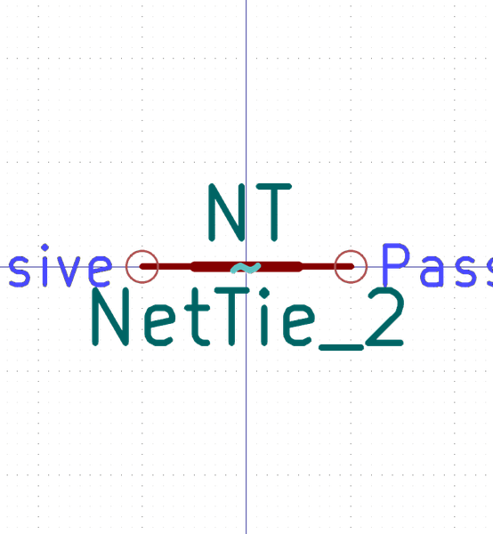

# Electronic Nettie 2 Nets Through Hole

  
* oomp_key: oomp_electronic_nettie_2_nets_through_hole 
* short_code: nt2
* md5_6: c86bdf  
* github_link: https://github.com/oomlout/oomlout_oomp_part_src/tree/main/parts/electronic_nettie_2_nets_through_hole/working  
## naming details
* classification -- electronic
* type -- nettie
* size -- 2_nets
* color -- 
* description_main -- through_hole
* description_extra -- 
* manucaturer -- 
* part_number -- 

## symbol

  
oomp_key: oomp_kicad_device_nettie_2  
link: https://github.com/oomlout/oomlout_oomp_symbol_bot/tree/main/symbols/kicad_device_nettie_2/working  

## footprint

  
oomp_key: oomp_kicad_nettie_nettie_2_tht_pad0_3mm  
link: https://github.com/oomlout/oomlout_oomp_footprint_bot/tree/main/footprints/kicad_nettie_nettie_2_tht_pad0_3mm/working  

## full_summary
| name | value | 
| --- | --- | 
| name | value | 
| classification | electronic | 
| type | nettie | 
| size | 2_nets | 
| color |  | 
| description_main | through_hole | 
| description_extra |  | 
| manufacturer |  | 
| part_number |  | 
| filter |  | 
| kicad_reference |  | 
| id | electronic_nettie_2_nets_through_hole | 
| oomp_key | oomp_electronic_nettie_2_nets_through_hole | 
| github_link | https://github.com/oomlout/oomlout_oomp_part_src/tree/main/parts/electronic_nettie_2_nets_through_hole/working | 
| directory | parts/electronic_nettie_2_nets_through_hole | 
| name | Electronic Nettie 2 Nets Through Hole | 
| short_code | nt2 | 
| distributors | [] | 
| manufacturers | [] | 
| md5 | c86bdf842046e81ba413e322d79ac3dc | 
| md5_5 | c86bd | 
| md5_6 | c86bdf | 
| md5_10 | c86bdf8420 | 
| footprint | [{'link': 'https://github.com/oomlout/oomlout_oomp_footprint_bot/tree/main/foootprntss/kicad_nettie_nettie_2_tht_pad0_3mm', 'oomp_key': 'oomp_kicad_nettie_nettie_2_tht_pad0_3mm', 'directory': 'oomlout_oomp_footprint_bot/footprints/kicad_nettie_nettie_2_tht_pad0_3mm//working/working.kicad_mod'}] | 
| symbol | [{'link': 'https://github.com/oomlout/oomlout_oomp_symbol_bot/tree/main/symbols/kicad_device_nettie_2', 'oomp_key': 'oomp_kicad_device_nettie_2', 'directory': 'oomlout_oomp_symbol_bot/symbols/kicad_device_nettie_2//working/working.kicad_sym'}] | 
