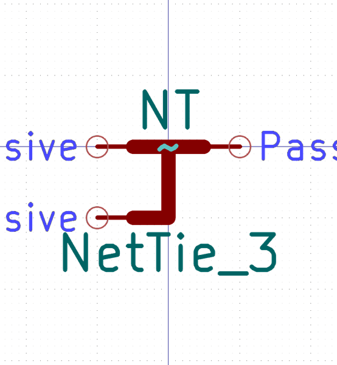

# Electronic Nettie 3 Nets Smd
oomp_key: oomp_electronic_nettie_3_nets_smd 

short_code: nt3
md5_6: 494314
github_link: https://github.com/oomlout/oomlout_oomp_part_src/tree/main/parts/electronic_nettie_3_nets_smd/working
## naming details
* classification -- electronic
* type -- nettie
* size -- 3_nets
* color -- 
* description_main -- smd
* description_extra -- 
* manucaturer -- 
* part_number -- 

## symbol

  
oomp_key: oomp_kicad_device_nettie_3  
link: https://github.com/oomlout/oomlout_oomp_symbol_bot/tree/main/symbols/kicad_device_nettie_3/working  

## footprint

  
oomp_key: oomp_kicad_nettie_nettie_3_smd_pad0_5mm  
link: https://github.com/oomlout/oomlout_oomp_footprint_bot/tree/main/foootprntss/kicad_nettie_nettie_3_smd_pad0_5mm/working  

## full_summary
| name | value | 
| --- | --- | 
| name | value | 
| classification | electronic | 
| type | nettie | 
| size | 3_nets | 
| color |  | 
| description_main | smd | 
| description_extra |  | 
| manufacturer |  | 
| part_number |  | 
| from_yaml | False | 
| filter |  | 
| kicad_reference |  | 
| id | electronic_nettie_3_nets_smd | 
| oomp_key | oomp_electronic_nettie_3_nets_smd | 
| github_link | https://github.com/oomlout/oomlout_oomp_part_src/tree/main/parts/electronic_nettie_3_nets_smd/working | 
| directory | parts/electronic_nettie_3_nets_smd | 
| name | Electronic Nettie 3 Nets Smd | 
| short_code | nt3 | 
| distributors | [] | 
| manufacturers | [] | 
| md5 | 494314f1c04b845b745ce0bd6ae8e357 | 
| md5_5 | 49431 | 
| md5_6 | 494314 | 
| md5_10 | 494314f1c0 | 
| footprint | [{'link': 'https://github.com/oomlout/oomlout_oomp_footprint_bot/tree/main/foootprntss/kicad_nettie_nettie_3_smd_pad0_5mm', 'oomp_key': 'oomp_kicad_nettie_nettie_3_smd_pad0_5mm', 'directory': 'oomlout_oomp_footprint_bot/footprints/kicad_nettie_nettie_3_smd_pad0_5mm//working/working.kicad_mod'}] | 
| symbol | [{'link': 'https://github.com/oomlout/oomlout_oomp_symbol_bot/tree/main/symbols/kicad_device_nettie_3', 'oomp_key': 'oomp_kicad_device_nettie_3', 'directory': 'oomlout_oomp_symbol_bot/symbols/kicad_device_nettie_3//working/working.kicad_sym'}] | 
