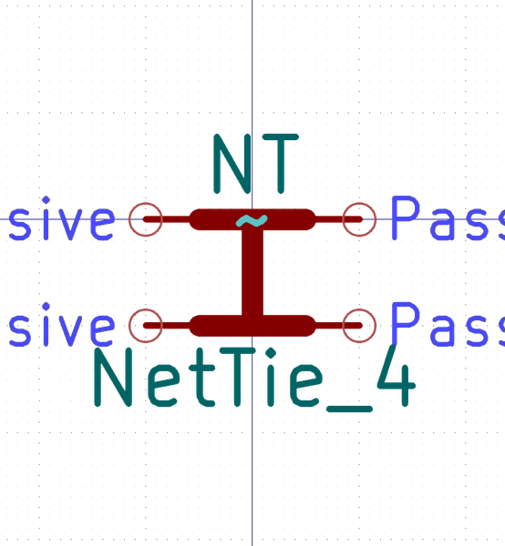

# Electronic Nettie 4 Nets Through Hole

  
* oomp_key: oomp_electronic_nettie_4_nets_through_hole 
* short_code: nt4th
* md5_6: ac52ab  
* github_link: https://github.com/oomlout/oomlout_oomp_part_src/tree/main/parts/electronic_nettie_4_nets_through_hole/working  
## naming details
* classification -- electronic
* type -- nettie
* size -- 4_nets
* color -- 
* description_main -- through_hole
* description_extra -- 
* manucaturer -- 
* part_number -- 

## symbol

  
oomp_key: oomp_kicad_device_nettie_4  
link: https://github.com/oomlout/oomlout_oomp_symbol_bot/tree/main/symbols/kicad_device_nettie_4/working  

## footprint

  
oomp_key: oomp_kicad_nettie_nettie_4_tht_pad0_3mm  
link: https://github.com/oomlout/oomlout_oomp_footprint_bot/tree/main/footprints/kicad_nettie_nettie_4_tht_pad0_3mm/working  

## full_summary
| name | value | 
| --- | --- | 
| name | value | 
| classification | electronic | 
| type | nettie | 
| size | 4_nets | 
| color |  | 
| description_main | through_hole | 
| description_extra |  | 
| manufacturer |  | 
| part_number |  | 
| filter |  | 
| kicad_reference |  | 
| id | electronic_nettie_4_nets_through_hole | 
| id_no_class | nettie_4_nets_through_hole | 
| id_no_type | 4_nets_through_hole | 
| oomp_key | oomp_electronic_nettie_4_nets_through_hole | 
| github_link | https://github.com/oomlout/oomlout_oomp_part_src/tree/main/parts/electronic_nettie_4_nets_through_hole/working | 
| directory | parts/electronic_nettie_4_nets_through_hole | 
| name | Electronic Nettie 4 Nets Through Hole | 
| short_code | nt4th | 
| short_code_upper | NT4TH | 
| distributors | [] | 
| manufacturers | [] | 
| md5 | ac52abec84c9c9c28eb15db0ca925cd9 | 
| md5_5 | ac52a | 
| md5_5_upper | AC52A | 
| md5_6 | ac52ab | 
| md5_6_upper | AC52AB | 
| md5_6_alpha | 6q20b | 
| md5_6_alpha_upper | 6Q20B | 
| md5_10 | ac52abec84 | 
| md5_10_upper | AC52ABEC84 | 
| type_first_letter | n | 
| type_first_letter_upper | N | 
| size_only_numbers | 4 | 
| size_only_numbers_no_zeros | 4 | 
| color_upper |  | 
| color_first_letter |  | 
| color_first_letter_upper |  | 
| description_only_numbers |  | 
| description_only_numbers_short |   | 
| description_or_color |   | 
| description_or_color_upper |   | 
| markdown_full | [electronic_nettie_4_nets_through_hole](https://github.com/oomlout/oomlout_oomp_part_src/tree/main/parts/electronic_nettie_4_nets_through_hole/working) [nt4th](https://github.com/oomlout/oomlout_oomp_part_src/tree/main/parts/electronic_nettie_4_nets_through_hole/working) [Electronic Nettie 4 Nets Through Hole](https://github.com/oomlout/oomlout_oomp_part_src/tree/main/parts/electronic_nettie_4_nets_through_hole/working)   | 
| markdown_short | [electronic_nettie_4_nets_through_hole](https://github.com/oomlout/oomlout_oomp_part_src/tree/main/parts/electronic_nettie_4_nets_through_hole/working)   | 
| footprint | [{'link': 'https://github.com/oomlout/oomlout_oomp_footprint_bot/tree/main/foootprntss/kicad_nettie_nettie_4_tht_pad0_3mm', 'oomp_key': 'oomp_kicad_nettie_nettie_4_tht_pad0_3mm', 'directory': 'oomlout_oomp_footprint_bot/footprints/kicad_nettie_nettie_4_tht_pad0_3mm//working/working.kicad_mod'}] | 
| symbol | [{'link': 'https://github.com/oomlout/oomlout_oomp_symbol_bot/tree/main/symbols/kicad_device_nettie_4', 'oomp_key': 'oomp_kicad_device_nettie_4', 'directory': 'oomlout_oomp_symbol_bot/symbols/kicad_device_nettie_4//working/working.kicad_sym'}] | 
