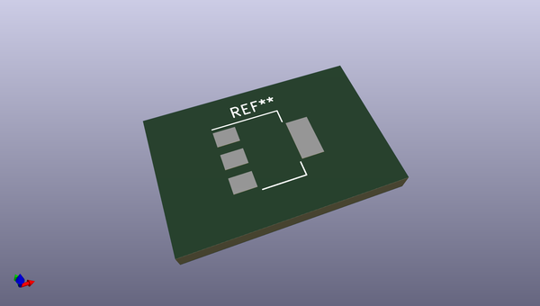

# OOMP Footprint  
## SOT-223-3_TabPin2  by oomlout  
  
oomp key: oomp_oomlout_oomlout_oomp_part_footprints_pms22311171d5v_electronic_pmic_sot_223_linear_1117_1_5_volt  
  
source repo at: [http://github.com/oomlout/oomlout_oomp_part_kicad_footprints/blob/master/tmp/data/oomlout_oomp_footprint_src/oomlout_oomp_part_footprints.pretty/xcr3213mhz8_electronic_ceramic_resonator_3213_3_pin_ground_pin_2_8_mega_hertz_1.kicad_mod](http://github.com/oomlout/oomlout_oomp_part_kicad_footprints/blob/master/tmp/data/oomlout_oomp_footprint_src/oomlout_oomp_part_footprints.pretty/xcr3213mhz8_electronic_ceramic_resonator_3213_3_pin_ground_pin_2_8_mega_hertz_1.kicad_mod)  
## Footprint  
  
  
  
  
| name | value | 
| --- | --- | 
| footprint name | SOT-223-3_TabPin2 | 
| footprint description | module CMS SOT223 4 pins | 
| number of pads | 4 | 
| github path | http://github.com/oomlout/oomlout_oomp_part_kicad_footprints/blob/master/tmp/data/oomlout_oomp_footprint_src/oomlout_oomp_part_footprints.pretty/pms22311171d5v_electronic_pmic_sot_223_linear_1117_1_5_volt.kicad_mod | 
| oomp key | oomp_oomlout_oomlout_oomp_part_footprints_pms22311171d5v_electronic_pmic_sot_223_linear_1117_1_5_volt | 
| oomp bot github | https://github.com/oomlout/oomlout_oomp_footprint_bot/tree/main/tmp/data/oomlout_oomp_footprint_src/footprints/oomlout_oomlout_oomp_part_footprints_pms22311171d5v_electronic_pmic_sot_223_linear_1117_1_5_volt/working | 
## Images  
