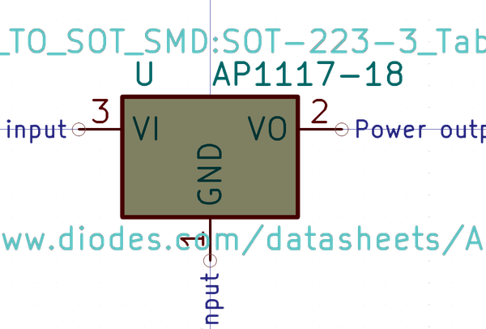
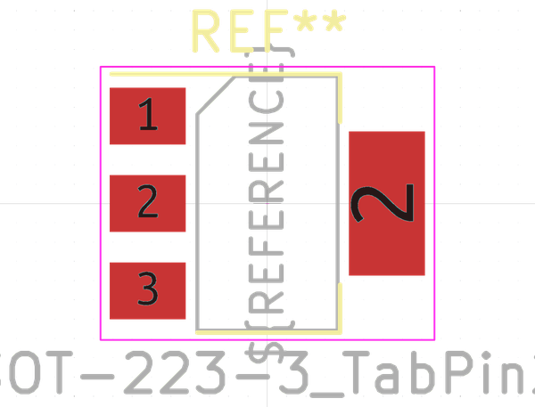

# Electronic Pmic Sot 223 Linear 1117 1 8 Volt
oomp_key: oomp_electronic_pmic_sot_223_linear_1117_1_8_volt 

short_code: pms2231117
md5_6: 1ae2ec
github_link: https://github.com/oomlout/oomlout_oomp_part_src/tree/main/parts/electronic_pmic_sot_223_linear_1117_1_8_volt/working
## naming details
* classification -- electronic
* type -- pmic
* size -- sot_223
* color -- linear
* description_main -- 1117
* description_extra -- 1_8_volt
* manucaturer -- 
* part_number -- 

## symbol

  
oomp_key: oomp_kicad_regulator_linear_ap1117_18  
link: https://github.com/oomlout/oomlout_oomp_symbol_bot/tree/main/symbols/kicad_regulator_linear_ap1117_18/working  

## footprint

  
oomp_key: oomp_kicad_package_to_sot_smd_sot_223_3_tabpin2  
link: https://github.com/oomlout/oomlout_oomp_footprint_bot/tree/main/foootprntss/kicad_package_to_sot_smd_sot_223_3_tabpin2/working  

## full_summary
| name | value | 
| --- | --- | 
| name | value | 
| classification | electronic | 
| type | pmic | 
| size | sot_223 | 
| color | linear | 
| description_main | 1117 | 
| description_extra | 1_8_volt | 
| manufacturer |  | 
| part_number |  | 
| short_name |  | 
| id | electronic_pmic_sot_223_linear_1117_1_8_volt | 
| oomp_key | oomp_electronic_pmic_sot_223_linear_1117_1_8_volt | 
| github_link | https://github.com/oomlout/oomlout_oomp_part_src/tree/main/parts/electronic_pmic_sot_223_linear_1117_1_8_volt/working | 
| directory | parts/electronic_pmic_sot_223_linear_1117_1_8_volt | 
| name | Electronic Pmic Sot 223 Linear 1117 1 8 Volt | 
| short_code | pms2231117 | 
| distributors | [] | 
| manufacturers | [] | 
| md5 | 1ae2ec9bc6ca9d86e38f14487d5958be | 
| md5_5 | 1ae2e | 
| md5_6 | 1ae2ec | 
| md5_10 | 1ae2ec9bc6 | 
| footprint | [{'link': 'https://github.com/oomlout/oomlout_oomp_footprint_bot/tree/main/foootprntss/kicad_package_to_sot_smd_sot_223_3_tabpin2', 'oomp_key': 'oomp_kicad_package_to_sot_smd_sot_223_3_tabpin2', 'directory': 'oomlout_oomp_footprint_bot/footprints/kicad_package_to_sot_smd_sot_223_3_tabpin2//working/working.kicad_mod'}] | 
| symbol | [{'link': 'https://github.com/oomlout/oomlout_oomp_symbol_bot/tree/main/symbols/kicad_regulator_linear_ap1117_18', 'oomp_key': 'oomp_kicad_regulator_linear_ap1117_18', 'directory': 'oomlout_oomp_symbol_bot/symbols/kicad_regulator_linear_ap1117_18//working/working.kicad_sym'}] | 
