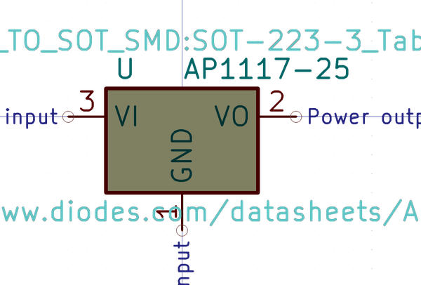

# Electronic Pmic Sot 223 Linear 1117 2 5 Volt
oomp_key: oomp_electronic_pmic_sot_223_linear_1117_2_5_volt  

short_code: pms22311172d5v
## naming details
* classification -- electronic
* type -- pmic
* size -- sot_223
* color -- linear
* description_main -- 1117
* description_extra -- 2_5_volt
* manucaturer -- 
* part_number -- 
## pinout

List of Pins:

## symbol

  
oomp_key: oomp_kicad_regulator_linear_ap1117_25
link: https://github.com/oomlout/oomlout_oomp_symbol_bot/tree/main/symbols/kicad_regulator_linear_ap1117_25/working

## footprint

  
oomp_key: oomp_kicad_package_to_sot_smd_sot_223
link: https://github.com/oomlout/oomlout_oomp_footprint_bot/tree/main/foootprntss/kicad_package_to_sot_smd_sot_223/working
