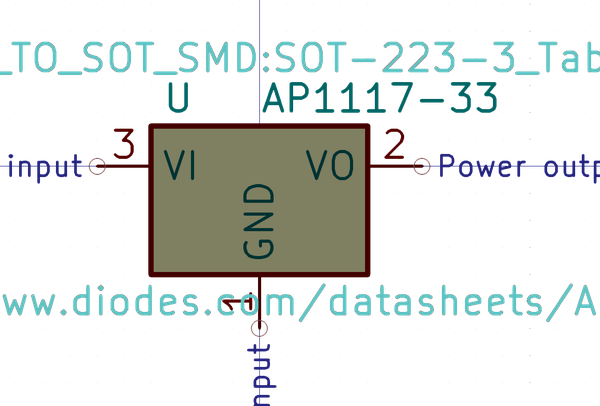

# Electronic Pmic Sot 223 Linear 1117 3 3 Volt

  
* oomp_key: oomp_electronic_pmic_sot_223_linear_1117_3_3_volt 
* short_code: pms22311173d3v
* md5_6: 24ed55  
* github_link: https://github.com/oomlout/oomlout_oomp_part_src/tree/main/parts/electronic_pmic_sot_223_linear_1117_3_3_volt/working  
## naming details
* classification -- electronic
* type -- pmic
* size -- sot_223
* color -- linear
* description_main -- 1117
* description_extra -- 3_3_volt
* manucaturer -- 
* part_number -- 

## symbol

  
oomp_key: oomp_kicad_regulator_linear_ap1117_33  
link: https://github.com/oomlout/oomlout_oomp_symbol_bot/tree/main/symbols/kicad_regulator_linear_ap1117_33/working  

## footprint

  
oomp_key: oomp_kicad_package_to_sot_smd_sot_223_3_tabpin2  
link: https://github.com/oomlout/oomlout_oomp_footprint_bot/tree/main/footprints/kicad_package_to_sot_smd_sot_223_3_tabpin2/working  

## full_summary
| name | value | 
| --- | --- | 
| name | value | 
| classification | electronic | 
| type | pmic | 
| size | sot_223 | 
| color | linear | 
| description_main | 1117 | 
| description_extra | 3_3_volt | 
| manufacturer |  | 
| part_number |  | 
| short_name |  | 
| id | electronic_pmic_sot_223_linear_1117_3_3_volt | 
| oomp_key | oomp_electronic_pmic_sot_223_linear_1117_3_3_volt | 
| github_link | https://github.com/oomlout/oomlout_oomp_part_src/tree/main/parts/electronic_pmic_sot_223_linear_1117_3_3_volt/working | 
| directory | parts/electronic_pmic_sot_223_linear_1117_3_3_volt | 
| name | Electronic Pmic Sot 223 Linear 1117 3 3 Volt | 
| short_code | pms22311173d3v | 
| short_code_upper | PMS22311173D3V | 
| distributors | [] | 
| manufacturers | [] | 
| package_style | smd_tape | 
| smd_tape_width | 12_mm | 
| smd_tape_depth | 2_mm | 
| smd_tape_pitch | 8_mm | 
| md5 | 24ed557c93e5cb4d939bb45cf16d2762 | 
| md5_5 | 24ed5 | 
| md5_6 | 24ed55 | 
| md5_10 | 24ed557c93 | 
| markdown_full | [electronic_pmic_sot_223_linear_1117_3_3_volt](https://github.com/oomlout/oomlout_oomp_part_src/tree/main/parts/electronic_pmic_sot_223_linear_1117_3_3_volt/working) [pms22311173d3v](https://github.com/oomlout/oomlout_oomp_part_src/tree/main/parts/electronic_pmic_sot_223_linear_1117_3_3_volt/working) [Electronic Pmic Sot 223 Linear 1117 3 3 Volt](https://github.com/oomlout/oomlout_oomp_part_src/tree/main/parts/electronic_pmic_sot_223_linear_1117_3_3_volt/working)   | 
| markdown_short | [electronic_pmic_sot_223_linear_1117_3_3_volt](https://github.com/oomlout/oomlout_oomp_part_src/tree/main/parts/electronic_pmic_sot_223_linear_1117_3_3_volt/working)   | 
| footprint | [{'link': 'https://github.com/oomlout/oomlout_oomp_footprint_bot/tree/main/foootprntss/kicad_package_to_sot_smd_sot_223_3_tabpin2', 'oomp_key': 'oomp_kicad_package_to_sot_smd_sot_223_3_tabpin2', 'directory': 'oomlout_oomp_footprint_bot/footprints/kicad_package_to_sot_smd_sot_223_3_tabpin2//working/working.kicad_mod'}] | 
| symbol | [{'link': 'https://github.com/oomlout/oomlout_oomp_symbol_bot/tree/main/symbols/kicad_regulator_linear_ap1117_33', 'oomp_key': 'oomp_kicad_regulator_linear_ap1117_33', 'directory': 'oomlout_oomp_symbol_bot/symbols/kicad_regulator_linear_ap1117_33//working/working.kicad_sym'}] | 
