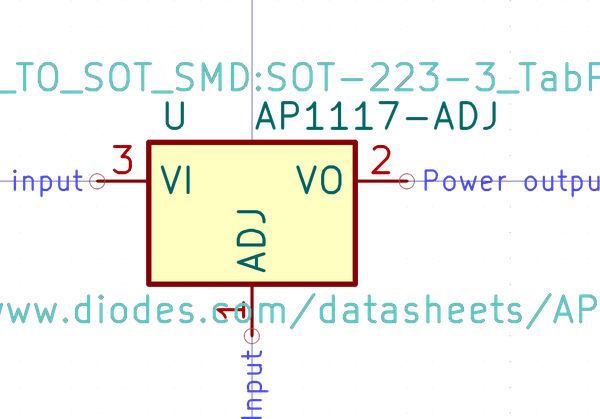
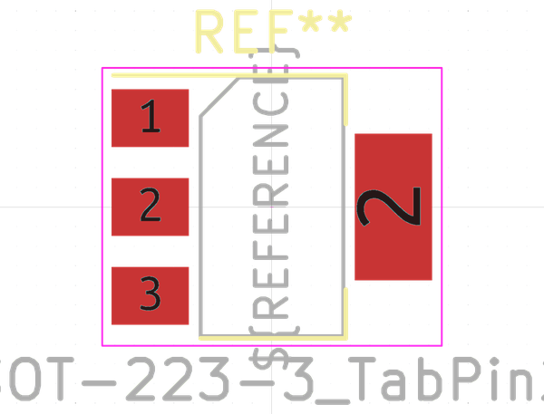

# Electronic Pmic Sot 223 Linear 1117 Adj
oomp_key: oomp_electronic_pmic_sot_223_linear_1117_adj  

short_code: pms2231117
## naming details
* classification -- electronic
* type -- pmic
* size -- sot_223
* color -- linear
* description_main -- 1117
* description_extra -- adj
* manucaturer -- 
* part_number -- 

## symbol

  
oomp_key: oomp_kicad_regulator_linear_ap1117_adj  
link: https://github.com/oomlout/oomlout_oomp_symbol_bot/tree/main/symbols/kicad_regulator_linear_ap1117_adj/working  

## footprint

  
oomp_key: oomp_kicad_package_to_sot_smd_sot_223_3_tabpin2  
link: https://github.com/oomlout/oomlout_oomp_footprint_bot/tree/main/foootprntss/kicad_package_to_sot_smd_sot_223_3_tabpin2/working  
