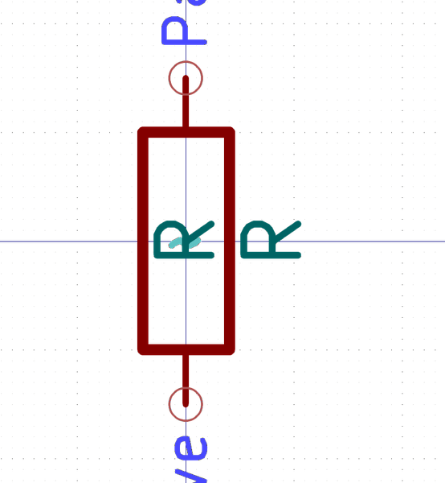

# Electronic Resistor 0201 100 Ohm

  
* oomp_key: oomp_electronic_resistor_0201_100_ohm 
* short_code: ro101
* md5_6: f20264  
* github_link: https://github.com/oomlout/oomlout_oomp_part_src/tree/main/parts/electronic_resistor_0201_100_ohm/working  
## naming details
* classification -- electronic
* type -- resistor
* size -- 0201
* color -- 
* description_main -- 100_ohm
* description_extra -- 
* manucaturer -- 
* part_number -- 

## distributors
* [LCSC - C965346](https://lcsc.com/product-detail/C965346.html)  

## manufacturers
* [Uniroyal - NQ01WMJ0101TEE]()  

## symbol

  
oomp_key: oomp_kicad_device_r  
link: https://github.com/oomlout/oomlout_oomp_symbol_bot/tree/main/symbols/kicad_device_r/working  

## full_summary
| name | value | 
| --- | --- | 
| name | value | 
| classification | electronic | 
| type | resistor | 
| size | 0201 | 
| color |  | 
| description_main | 100_ohm | 
| description_extra |  | 
| manufacturer |  | 
| part_number |  | 
| filter |  | 
| kicad_reference | R | 
| id | electronic_resistor_0201_100_ohm | 
| id_no_class | resistor_0201_100_ohm | 
| id_no_type | 0201_100_ohm | 
| oomp_key | oomp_electronic_resistor_0201_100_ohm | 
| github_link | https://github.com/oomlout/oomlout_oomp_part_src/tree/main/parts/electronic_resistor_0201_100_ohm/working | 
| directory | parts/electronic_resistor_0201_100_ohm | 
| name | Electronic Resistor 0201 100 Ohm | 
| short_code | ro101 | 
| short_code_upper | RO101 | 
| distributors | [{'name': 'LCSC', 'part_number': 'C965346', 'link': 'https://lcsc.com/product-detail/C965346.html', 'id': 'distributor_lcsc'}] | 
| manufacturers | [{'name': 'Uniroyal', 'part_number': 'NQ01WMJ0101TEE', 'link': '', 'id': 'manufacturer_uniroyal', 'note': {'reason': 'did this one first, but not in jlc pcb basic parts and 1 percent are and they are the same price', 'reason_short': 'not in jlc basic parts'}}] | 
| md5 | f2026482a1dc7d66f97269197301686a | 
| md5_5 | f2026 | 
| md5_6 | f20264 | 
| md5_10 | f2026482a1 | 
| markdown_full | [electronic_resistor_0201_100_ohm](https://github.com/oomlout/oomlout_oomp_part_src/tree/main/parts/electronic_resistor_0201_100_ohm/working) [ro101](https://github.com/oomlout/oomlout_oomp_part_src/tree/main/parts/electronic_resistor_0201_100_ohm/working) [Electronic Resistor 0201 100 Ohm](https://github.com/oomlout/oomlout_oomp_part_src/tree/main/parts/electronic_resistor_0201_100_ohm/working) [LCSC - C965346 ](https://lcsc.com/product-detail/C965346.html) [Uniroyal - NQ01WMJ0101TEE- not in jlc basic parts]() [(L)  ](https://www.lcsc.com/search?q=NQ01WMJ0101TEE)[(D)  ](https://www.digikey.com/en/products?keywords=NQ01WMJ0101TEE)[(M)  ](https://www.mouser.com/Search/Refine?Keyword=NQ01WMJ0101TEE)[(N)  ](https://www.newark.com/search?st=NQ01WMJ0101TEE)[(SZ)  ](https://so.szlcsc.com/global.html?k=NQ01WMJ0101TEE)  | 
| markdown_short | [electronic_resistor_0201_100_ohm](https://github.com/oomlout/oomlout_oomp_part_src/tree/main/parts/electronic_resistor_0201_100_ohm/working) [LCSC - C965346 ](https://lcsc.com/product-detail/C965346.html) [Uniroyal - NQ01WMJ0101TEE- not in jlc basic parts]() | 
| symbol | [{'link': 'https://github.com/oomlout/oomlout_oomp_symbol_bot/tree/main/symbols/kicad_device_r', 'oomp_key': 'oomp_kicad_device_r', 'directory': 'oomlout_oomp_symbol_bot/symbols/kicad_device_r//working/working.kicad_sym'}] | 
