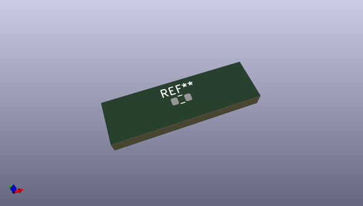

# OOMP Footprint  
## R_0603_1608Metric  by oomlout  
  
oomp key: oomp_oomlout_oomlout_oomp_part_footprints_r6o393_electronic_resistor_0603_39000_ohm  
  
source repo at: [http://github.com/oomlout/oomlout_oomp_part_kicad_footprints/blob/master/tmp/data/oomlout_oomp_footprint_src/oomlout_oomp_part_footprints.pretty/xcr3213mhz8_electronic_ceramic_resonator_3213_3_pin_ground_pin_2_8_mega_hertz_1.kicad_mod](http://github.com/oomlout/oomlout_oomp_part_kicad_footprints/blob/master/tmp/data/oomlout_oomp_footprint_src/oomlout_oomp_part_footprints.pretty/xcr3213mhz8_electronic_ceramic_resonator_3213_3_pin_ground_pin_2_8_mega_hertz_1.kicad_mod)  
## Footprint  
  
  
  
  
| name | value | 
| --- | --- | 
| footprint name | R_0603_1608Metric | 
| footprint description | Resistor SMD 0603 (1608 Metric), square (rectangular) end terminal, IPC_7351 nominal, (Body size source: IPC-SM-782 page 72, https://www.pcb-3d.com/wordpress/wp-content/uploads/ipc-sm-782a_amendment_1_and_2.pdf), generated with kicad-footprint-generator | 
| number of pads | 2 | 
| github path | http://github.com/oomlout/oomlout_oomp_part_kicad_footprints/blob/master/tmp/data/oomlout_oomp_footprint_src/oomlout_oomp_part_footprints.pretty/r6o393_electronic_resistor_0603_39000_ohm.kicad_mod | 
| oomp key | oomp_oomlout_oomlout_oomp_part_footprints_r6o393_electronic_resistor_0603_39000_ohm | 
| oomp bot github | https://github.com/oomlout/oomlout_oomp_footprint_bot/tree/main/tmp/data/oomlout_oomp_footprint_src/footprints/oomlout_oomlout_oomp_part_footprints_r6o393_electronic_resistor_0603_39000_ohm/working | 
## Images  
