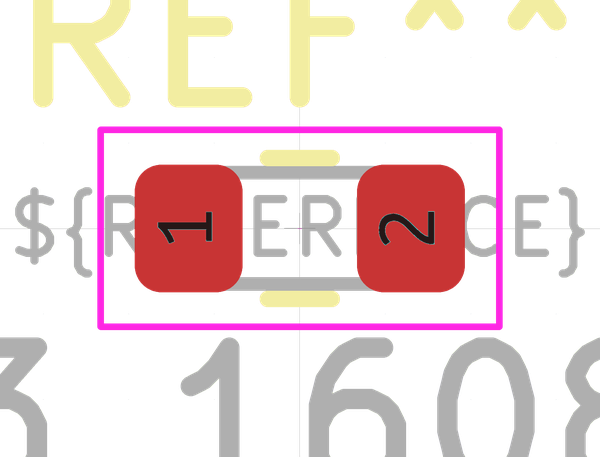

# Electronic Resistor 0603 56000 Ohm

  
* oomp_key: oomp_electronic_resistor_0603_56000_ohm 
* short_code: r6o563
* md5_6: 5e9924  
* github_link: https://github.com/oomlout/oomlout_oomp_part_src/tree/main/parts/electronic_resistor_0603_56000_ohm/working  
## naming details
* classification -- electronic
* type -- resistor
* size -- 0603
* color -- 
* description_main -- 56000_ohm
* description_extra -- 
* manucaturer -- 
* part_number -- 

## distributors
* [LCSC - C137618](https://lcsc.com/product-detail/C137618.html)  
* [LCSC - C25603](https://lcsc.com/product-detail/C25603.html)  

## manufacturers
* [Uniroyal - 0603WAJ0563T5E]()  
* [Yageo - RC0603JR-0756KL](https://www.yageo.com/en/Chart/Download/pdf/RC0603JR-0756KL)  

## symbol

  
oomp_key: oomp_kicad_device_r  
link: https://github.com/oomlout/oomlout_oomp_symbol_bot/tree/main/symbols/kicad_device_r/working  

## footprint

  
oomp_key: oomp_kicad_resistor_smd_r_0603_1608metric  
link: https://github.com/oomlout/oomlout_oomp_footprint_bot/tree/main/footprints/kicad_resistor_smd_r_0603_1608metric/working  

## full_summary
| name | value | 
| --- | --- | 
| name | value | 
| classification | electronic | 
| type | resistor | 
| size | 0603 | 
| color |  | 
| description_main | 56000_ohm | 
| description_extra |  | 
| manufacturer |  | 
| part_number |  | 
| filter |  | 
| kicad_reference | R | 
| id | electronic_resistor_0603_56000_ohm | 
| oomp_key | oomp_electronic_resistor_0603_56000_ohm | 
| github_link | https://github.com/oomlout/oomlout_oomp_part_src/tree/main/parts/electronic_resistor_0603_56000_ohm/working | 
| directory | parts/electronic_resistor_0603_56000_ohm | 
| name | Electronic Resistor 0603 56000 Ohm | 
| short_code | r6o563 | 
| distributors | [{'name': 'LCSC', 'part_number': 'C137618', 'link': 'https://lcsc.com/product-detail/C137618.html', 'id': 'distributor_lcsc'}, {'name': 'LCSC', 'part_number': 'C25603', 'link': 'https://lcsc.com/product-detail/C25603.html', 'id': 'distributor_lcsc'}] | 
| manufacturers | [{'name': 'Uniroyal', 'part_number': '0603WAJ0563T5E', 'link': '', 'id': 'manufacturer_uniroyal'}, {'name': 'Yageo', 'part_number': 'RC0603JR-0756KL', 'link': 'https://www.yageo.com/en/Chart/Download/pdf/RC0603JR-0756KL', 'id': 'manufacturer_yageo'}] | 
| package_style | smd_tape | 
| smd_tape_width | 8_mm | 
| smd_tape_depth | 1_5_mm | 
| smd_tape_pitch | 4_mm | 
| md5 | 5e9924be9b909bac468394fc7c214ff3 | 
| md5_5 | 5e992 | 
| md5_6 | 5e9924 | 
| md5_10 | 5e9924be9b | 
| markdown_full | [electronic_resistor_0603_56000_ohm](https://github.com/oomlout/oomlout_oomp_part_src/tree/main/parts/electronic_resistor_0603_56000_ohm/working) [r6o563](https://github.com/oomlout/oomlout_oomp_part_src/tree/main/parts/electronic_resistor_0603_56000_ohm/working) [LCSC - C137618 ](https://lcsc.com/product-detail/C137618.html)[LCSC - C25603 ](https://lcsc.com/product-detail/C25603.html) [Uniroyal - 0603WAJ0563T5E [(L) ](https://www.lcsc.com/search?q=0603WAJ0563T5E)[(D) ](https://www.digikey.com/en/products?,keywords=0603WAJ0563T5E)[(M) ](https://www.mouser.com/Search/Refine?Keyword=0603WAJ0563T5E)[(N) ](https://www.newark.com/search?st=0603WAJ0563T5E)[(SZ) ](https://so.szlcsc.com/global.html?k=0603WAJ0563T5E)]()[Yageo - RC0603JR-0756KL [(L) ](https://www.lcsc.com/search?q=RC0603JR-0756KL)[(D) ](https://www.digikey.com/en/products?,keywords=RC0603JR-0756KL)[(M) ](https://www.mouser.com/Search/Refine?Keyword=RC0603JR-0756KL)[(N) ](https://www.newark.com/search?st=RC0603JR-0756KL)[(SZ) ](https://so.szlcsc.com/global.html?k=RC0603JR-0756KL)](https://www.yageo.com/en/Chart/Download/pdf/RC0603JR-0756KL) | 
| footprint | [{'link': 'https://github.com/oomlout/oomlout_oomp_footprint_bot/tree/main/foootprntss/kicad_resistor_smd_r_0603_1608metric', 'oomp_key': 'oomp_kicad_resistor_smd_r_0603_1608metric', 'directory': 'oomlout_oomp_footprint_bot/footprints/kicad_resistor_smd_r_0603_1608metric//working/working.kicad_mod'}] | 
| symbol | [{'link': 'https://github.com/oomlout/oomlout_oomp_symbol_bot/tree/main/symbols/kicad_device_r', 'oomp_key': 'oomp_kicad_device_r', 'directory': 'oomlout_oomp_symbol_bot/symbols/kicad_device_r//working/working.kicad_sym'}] | 
