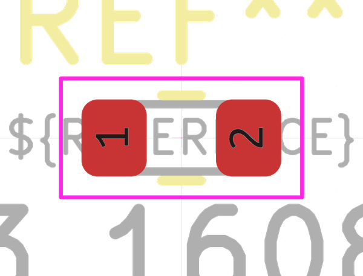

# Electronic Resistor 0603 5600 Ohm

  
* oomp_key: oomp_electronic_resistor_0603_5600_ohm 
* short_code: r6o562
* md5_6: 18de6f  
* github_link: https://github.com/oomlout/oomlout_oomp_part_src/tree/main/parts/electronic_resistor_0603_5600_ohm/working  
## naming details
* classification -- electronic
* type -- resistor
* size -- 0603
* color -- 
* description_main -- 5600_ohm
* description_extra -- 
* manucaturer -- 
* part_number -- 

## distributors
* [LCSC - C26001](https://lcsc.com/product-detail/C26001.html)  
* [LCSC - C127452](https://lcsc.com/product-detail/C127452.html)  

## manufacturers
* [Uniroyal - 0603WAJ0562T5E]()  
* [Uniroyal - 0603WAF5601T5E]()  
* [Yageo - RC0603JR-075K6L](https://www.yageo.com/en/Chart/Download/pdf/RC0603JR-075K6L)  

## symbol

  
oomp_key: oomp_kicad_device_r  
link: https://github.com/oomlout/oomlout_oomp_symbol_bot/tree/main/symbols/kicad_device_r/working  

## footprint

  
oomp_key: oomp_kicad_resistor_smd_r_0603_1608metric  
link: https://github.com/oomlout/oomlout_oomp_footprint_bot/tree/main/footprints/kicad_resistor_smd_r_0603_1608metric/working  

## full_summary
| name | value | 
| --- | --- | 
| name | value | 
| classification | electronic | 
| type | resistor | 
| size | 0603 | 
| color |  | 
| description_main | 5600_ohm | 
| description_extra |  | 
| manufacturer |  | 
| part_number |  | 
| filter |  | 
| kicad_reference | R | 
| id | electronic_resistor_0603_5600_ohm | 
| oomp_key | oomp_electronic_resistor_0603_5600_ohm | 
| github_link | https://github.com/oomlout/oomlout_oomp_part_src/tree/main/parts/electronic_resistor_0603_5600_ohm/working | 
| directory | parts/electronic_resistor_0603_5600_ohm | 
| name | Electronic Resistor 0603 5600 Ohm | 
| short_code | r6o562 | 
| short_code_upper | R6O562 | 
| distributors | [{'name': 'LCSC', 'part_number': 'C26001', 'link': 'https://lcsc.com/product-detail/C26001.html', 'id': 'distributor_lcsc'}, {'name': 'LCSC', 'part_number': 'C127452', 'link': 'https://lcsc.com/product-detail/C127452.html', 'id': 'distributor_lcsc'}] | 
| manufacturers | [{'name': 'Uniroyal', 'part_number': '0603WAJ0562T5E', 'link': '', 'id': 'manufacturer_uniroyal', 'note': {'reason': 'did this one first, but not in jlc pcb basic parts and 1 percent are and they are the same price', 'reason_short': 'not in jlc basic parts'}}, {'name': 'Uniroyal', 'part_number': '0603WAF5601T5E', 'link': '', 'id': 'manufacturer_uniroyal', 'note': {'reason': 'in the jlc basic parts catalogue', 'reason_short': 'jlc basic part'}}, {'name': 'Yageo', 'part_number': 'RC0603JR-075K6L', 'link': 'https://www.yageo.com/en/Chart/Download/pdf/RC0603JR-075K6L', 'id': 'manufacturer_yageo', 'note': {'reason': 'yageo is a commonly cross referenced part number', 'reason_short': 'available everywhere'}}] | 
| package_style | smd_tape | 
| smd_tape_width | 8_mm | 
| smd_tape_depth | 1_5_mm | 
| smd_tape_pitch | 4_mm | 
| md5 | 18de6fe05df36c4c720f1bdff76c0fc7 | 
| md5_5 | 18de6 | 
| md5_6 | 18de6f | 
| md5_10 | 18de6fe05d | 
| markdown_full | [electronic_resistor_0603_5600_ohm](https://github.com/oomlout/oomlout_oomp_part_src/tree/main/parts/electronic_resistor_0603_5600_ohm/working) [r6o562](https://github.com/oomlout/oomlout_oomp_part_src/tree/main/parts/electronic_resistor_0603_5600_ohm/working) [Electronic Resistor 0603 5600 Ohm](https://github.com/oomlout/oomlout_oomp_part_src/tree/main/parts/electronic_resistor_0603_5600_ohm/working) [LCSC - C26001 ](https://lcsc.com/product-detail/C26001.html)[LCSC - C127452 ](https://lcsc.com/product-detail/C127452.html) [Uniroyal - 0603WAJ0562T5E- not in jlc basic parts]() [(L)  ](https://www.lcsc.com/search?q=0603WAJ0562T5E)[(D)  ](https://www.digikey.com/en/products?keywords=0603WAJ0562T5E)[(M)  ](https://www.mouser.com/Search/Refine?Keyword=0603WAJ0562T5E)[(N)  ](https://www.newark.com/search?st=0603WAJ0562T5E)[(SZ)  ](https://so.szlcsc.com/global.html?k=0603WAJ0562T5E) [Uniroyal - 0603WAF5601T5E- jlc basic part]() [(L)  ](https://www.lcsc.com/search?q=0603WAF5601T5E)[(D)  ](https://www.digikey.com/en/products?keywords=0603WAF5601T5E)[(M)  ](https://www.mouser.com/Search/Refine?Keyword=0603WAF5601T5E)[(N)  ](https://www.newark.com/search?st=0603WAF5601T5E)[(SZ)  ](https://so.szlcsc.com/global.html?k=0603WAF5601T5E) [Yageo - RC0603JR-075K6L- available everywhere](https://www.yageo.com/en/Chart/Download/pdf/RC0603JR-075K6L) [(L)  ](https://www.lcsc.com/search?q=RC0603JR-075K6L)[(D)  ](https://www.digikey.com/en/products?keywords=RC0603JR-075K6L)[(M)  ](https://www.mouser.com/Search/Refine?Keyword=RC0603JR-075K6L)[(N)  ](https://www.newark.com/search?st=RC0603JR-075K6L)[(SZ)  ](https://so.szlcsc.com/global.html?k=RC0603JR-075K6L)  | 
| markdown_short | [electronic_resistor_0603_5600_ohm](https://github.com/oomlout/oomlout_oomp_part_src/tree/main/parts/electronic_resistor_0603_5600_ohm/working) [LCSC - C26001 ](https://lcsc.com/product-detail/C26001.html)[LCSC - C127452 ](https://lcsc.com/product-detail/C127452.html) [Uniroyal - 0603WAJ0562T5E- not in jlc basic parts]()[Uniroyal - 0603WAF5601T5E- jlc basic part]()[Yageo - RC0603JR-075K6L- available everywhere](https://www.yageo.com/en/Chart/Download/pdf/RC0603JR-075K6L) | 
| footprint | [{'link': 'https://github.com/oomlout/oomlout_oomp_footprint_bot/tree/main/foootprntss/kicad_resistor_smd_r_0603_1608metric', 'oomp_key': 'oomp_kicad_resistor_smd_r_0603_1608metric', 'directory': 'oomlout_oomp_footprint_bot/footprints/kicad_resistor_smd_r_0603_1608metric//working/working.kicad_mod'}] | 
| symbol | [{'link': 'https://github.com/oomlout/oomlout_oomp_symbol_bot/tree/main/symbols/kicad_device_r', 'oomp_key': 'oomp_kicad_device_r', 'directory': 'oomlout_oomp_symbol_bot/symbols/kicad_device_r//working/working.kicad_sym'}] | 
