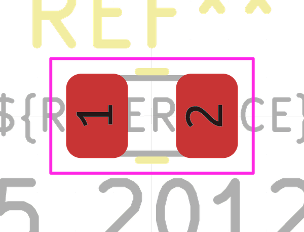

# Electronic Resistor 0805 120000 Ohm

  
* oomp_key: oomp_electronic_resistor_0805_120000_ohm 
* short_code: r8o124
* md5_6: a8217e  
* github_link: https://github.com/oomlout/oomlout_oomp_part_src/tree/main/parts/electronic_resistor_0805_120000_ohm/working  
## naming details
* classification -- electronic
* type -- resistor
* size -- 0805
* color -- 
* description_main -- 120000_ohm
* description_extra -- 
* manucaturer -- 
* part_number -- 

## symbol

  
oomp_key: oomp_kicad_device_r  
link: https://github.com/oomlout/oomlout_oomp_symbol_bot/tree/main/symbols/kicad_device_r/working  

## footprint

  
oomp_key: oomp_kicad_resistor_smd_r_0805_2012metric  
link: https://github.com/oomlout/oomlout_oomp_footprint_bot/tree/main/footprints/kicad_resistor_smd_r_0805_2012metric/working  

## full_summary
| name | value | 
| --- | --- | 
| name | value | 
| classification | electronic | 
| type | resistor | 
| size | 0805 | 
| color |  | 
| description_main | 120000_ohm | 
| description_extra |  | 
| manufacturer |  | 
| part_number |  | 
| filter |  | 
| kicad_reference | R | 
| id | electronic_resistor_0805_120000_ohm | 
| id_no_class | resistor_0805_120000_ohm | 
| id_no_type | 0805_120000_ohm | 
| oomp_key | oomp_electronic_resistor_0805_120000_ohm | 
| github_link | https://github.com/oomlout/oomlout_oomp_part_src/tree/main/parts/electronic_resistor_0805_120000_ohm/working | 
| directory | parts/electronic_resistor_0805_120000_ohm | 
| name | Electronic Resistor 0805 120000 Ohm | 
| short_code | r8o124 | 
| short_code_upper | R8O124 | 
| distributors | [] | 
| manufacturers | [] | 
| package_style | smd_tape | 
| smd_tape_width | 8_mm | 
| smd_tape_depth | 1_5_mm | 
| smd_tape_pitch | 4_mm | 
| md5 | a8217eb7afb94523c0640bb68d8eb1ba | 
| md5_5 | a8217 | 
| md5_5_upper | A8217 | 
| md5_6 | a8217e | 
| md5_6_upper | A8217E | 
| md5_6_alpha | 6k60u | 
| md5_6_alpha_upper | 6K60U | 
| md5_10 | a8217eb7af | 
| md5_10_upper | A8217EB7AF | 
| type_first_letter | r | 
| type_first_letter_upper | R | 
| size_only_numbers | 0805 | 
| size_only_numbers_no_zeros | 85 | 
| color_upper |  | 
| color_first_letter |  | 
| color_first_letter_upper |  | 
| description_only_numbers | 120000 | 
| description_only_numbers_short | 120k | 
| description_or_color | 120k | 
| description_or_color_upper | 120K | 
| markdown_full | [electronic_resistor_0805_120000_ohm](https://github.com/oomlout/oomlout_oomp_part_src/tree/main/parts/electronic_resistor_0805_120000_ohm/working) [r8o124](https://github.com/oomlout/oomlout_oomp_part_src/tree/main/parts/electronic_resistor_0805_120000_ohm/working) [Electronic Resistor 0805 120000 Ohm](https://github.com/oomlout/oomlout_oomp_part_src/tree/main/parts/electronic_resistor_0805_120000_ohm/working)   | 
| markdown_short | [electronic_resistor_0805_120000_ohm](https://github.com/oomlout/oomlout_oomp_part_src/tree/main/parts/electronic_resistor_0805_120000_ohm/working)   | 
| footprint | [{'link': 'https://github.com/oomlout/oomlout_oomp_footprint_bot/tree/main/foootprntss/kicad_resistor_smd_r_0805_2012metric', 'oomp_key': 'oomp_kicad_resistor_smd_r_0805_2012metric', 'directory': 'oomlout_oomp_footprint_bot/footprints/kicad_resistor_smd_r_0805_2012metric//working/working.kicad_mod'}] | 
| symbol | [{'link': 'https://github.com/oomlout/oomlout_oomp_symbol_bot/tree/main/symbols/kicad_device_r', 'oomp_key': 'oomp_kicad_device_r', 'directory': 'oomlout_oomp_symbol_bot/symbols/kicad_device_r//working/working.kicad_sym'}] | 
