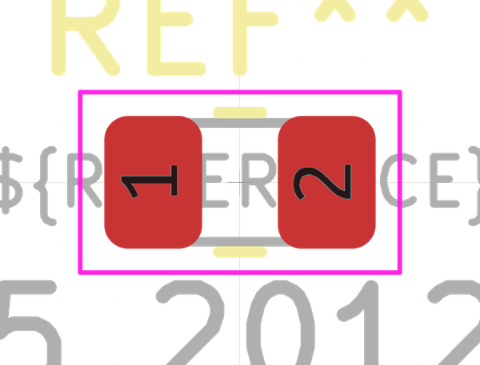

# Electronic Resistor 0805 27 Ohm

  
* oomp_key: oomp_electronic_resistor_0805_27_ohm 
* short_code: r8o270
* md5_6: f8f4b5  
* github_link: https://github.com/oomlout/oomlout_oomp_part_src/tree/main/parts/electronic_resistor_0805_27_ohm/working  
## naming details
* classification -- electronic
* type -- resistor
* size -- 0805
* color -- 
* description_main -- 27_ohm
* description_extra -- 
* manucaturer -- 
* part_number -- 

## manufacturers
* [Uniroyal - 0805W8J0270T5E]()  
* [Yageo - RC0805JR-0727RL](https://www.yageo.com/en/Chart/Download/pdf/RC0805JR-0727RL)  

## symbol

  
oomp_key: oomp_kicad_device_r  
link: https://github.com/oomlout/oomlout_oomp_symbol_bot/tree/main/symbols/kicad_device_r/working  

## footprint

  
oomp_key: oomp_kicad_resistor_smd_r_0805_2012metric  
link: https://github.com/oomlout/oomlout_oomp_footprint_bot/tree/main/footprints/kicad_resistor_smd_r_0805_2012metric/working  

## full_summary
| name | value | 
| --- | --- | 
| name | value | 
| classification | electronic | 
| type | resistor | 
| size | 0805 | 
| color |  | 
| description_main | 27_ohm | 
| description_extra |  | 
| manufacturer |  | 
| part_number |  | 
| filter |  | 
| kicad_reference | R | 
| id | electronic_resistor_0805_27_ohm | 
| oomp_key | oomp_electronic_resistor_0805_27_ohm | 
| github_link | https://github.com/oomlout/oomlout_oomp_part_src/tree/main/parts/electronic_resistor_0805_27_ohm/working | 
| directory | parts/electronic_resistor_0805_27_ohm | 
| name | Electronic Resistor 0805 27 Ohm | 
| short_code | r8o270 | 
| distributors | [] | 
| manufacturers | [{'name': 'Uniroyal', 'part_number': '0805W8J0270T5E', 'link': '', 'id': 'manufacturer_uniroyal'}, {'name': 'Yageo', 'part_number': 'RC0805JR-0727RL', 'link': 'https://www.yageo.com/en/Chart/Download/pdf/RC0805JR-0727RL', 'id': 'manufacturer_yageo'}] | 
| md5 | f8f4b5bf5547ca8aa94a87d2c5128597 | 
| md5_5 | f8f4b | 
| md5_6 | f8f4b5 | 
| md5_10 | f8f4b5bf55 | 
| markdown_full | [electronic_resistor_0805_27_ohm](https://github.com/oomlout/oomlout_oomp_part_src/tree/main/parts/electronic_resistor_0805_27_ohm/working) [r8o270](https://github.com/oomlout/oomlout_oomp_part_src/tree/main/parts/electronic_resistor_0805_27_ohm/working)  [Uniroyal - 0805W8J0270T5E [(L) ](https://www.lcsc.com/search?q=0805W8J0270T5E)[(D) ](https://www.digikey.com/en/products?,keywords=0805W8J0270T5E)[(M) ](https://www.mouser.com/Search/Refine?Keyword=0805W8J0270T5E)[(N) ](https://www.newark.com/search?st=0805W8J0270T5E)[(SZ) ](https://so.szlcsc.com/global.html?k=0805W8J0270T5E)]()[Yageo - RC0805JR-0727RL [(L) ](https://www.lcsc.com/search?q=RC0805JR-0727RL)[(D) ](https://www.digikey.com/en/products?,keywords=RC0805JR-0727RL)[(M) ](https://www.mouser.com/Search/Refine?Keyword=RC0805JR-0727RL)[(N) ](https://www.newark.com/search?st=RC0805JR-0727RL)[(SZ) ](https://so.szlcsc.com/global.html?k=RC0805JR-0727RL)](https://www.yageo.com/en/Chart/Download/pdf/RC0805JR-0727RL) | 
| footprint | [{'link': 'https://github.com/oomlout/oomlout_oomp_footprint_bot/tree/main/foootprntss/kicad_resistor_smd_r_0805_2012metric', 'oomp_key': 'oomp_kicad_resistor_smd_r_0805_2012metric', 'directory': 'oomlout_oomp_footprint_bot/footprints/kicad_resistor_smd_r_0805_2012metric//working/working.kicad_mod'}] | 
| symbol | [{'link': 'https://github.com/oomlout/oomlout_oomp_symbol_bot/tree/main/symbols/kicad_device_r', 'oomp_key': 'oomp_kicad_device_r', 'directory': 'oomlout_oomp_symbol_bot/symbols/kicad_device_r//working/working.kicad_sym'}] | 
