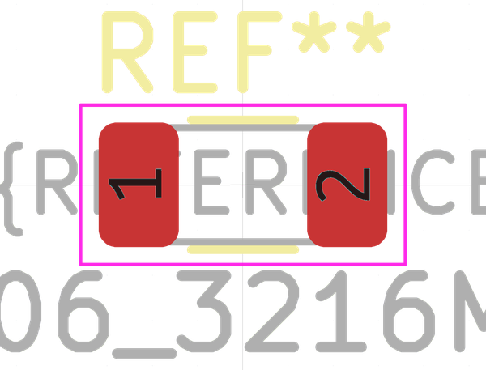

# Electronic Resistor 1206 39000 Ohm

  
* oomp_key: oomp_electronic_resistor_1206_39000_ohm 
* short_code: r12o393
* md5_6: f9eee7  
* github_link: https://github.com/oomlout/oomlout_oomp_part_src/tree/main/parts/electronic_resistor_1206_39000_ohm/working  
## naming details
* classification -- electronic
* type -- resistor
* size -- 1206
* color -- 
* description_main -- 39000_ohm
* description_extra -- 
* manucaturer -- 
* part_number -- 

## manufacturers
* [Uniroyal - 1206W4J0393T5E]()  
* [Uniroyal - 1206W4F3902T5E]()  
* [Yageo - RC1206JR-0739KL](https://www.yageo.com/en/Chart/Download/pdf/RC1206JR-0739KL)  

## symbol

  
oomp_key: oomp_kicad_device_r  
link: https://github.com/oomlout/oomlout_oomp_symbol_bot/tree/main/symbols/kicad_device_r/working  

## footprint

  
oomp_key: oomp_kicad_resistor_smd_r_1206_3216metric  
link: https://github.com/oomlout/oomlout_oomp_footprint_bot/tree/main/footprints/kicad_resistor_smd_r_1206_3216metric/working  

## full_summary
| name | value | 
| --- | --- | 
| name | value | 
| classification | electronic | 
| type | resistor | 
| size | 1206 | 
| color |  | 
| description_main | 39000_ohm | 
| description_extra |  | 
| manufacturer |  | 
| part_number |  | 
| filter |  | 
| kicad_reference | R | 
| id | electronic_resistor_1206_39000_ohm | 
| id_no_class | resistor_1206_39000_ohm | 
| id_no_type | 1206_39000_ohm | 
| oomp_key | oomp_electronic_resistor_1206_39000_ohm | 
| github_link | https://github.com/oomlout/oomlout_oomp_part_src/tree/main/parts/electronic_resistor_1206_39000_ohm/working | 
| directory | parts/electronic_resistor_1206_39000_ohm | 
| name | Electronic Resistor 1206 39000 Ohm | 
| short_code | r12o393 | 
| short_code_upper | R12O393 | 
| distributors | [] | 
| manufacturers | [{'name': 'Uniroyal', 'part_number': '1206W4J0393T5E', 'link': '', 'id': 'manufacturer_uniroyal', 'note': {'reason': 'did this one first, but not in jlc pcb basic parts and 1 percent are and they are the same price', 'reason_short': 'not in jlc basic parts'}}, {'name': 'Uniroyal', 'part_number': '1206W4F3902T5E', 'link': '', 'id': 'manufacturer_uniroyal', 'note': {'reason': 'in the jlc basic parts catalogue', 'reason_short': 'jlc basic part'}}, {'name': 'Yageo', 'part_number': 'RC1206JR-0739KL', 'link': 'https://www.yageo.com/en/Chart/Download/pdf/RC1206JR-0739KL', 'id': 'manufacturer_yageo', 'note': {'reason': 'yageo is a commonly cross referenced part number', 'reason_short': 'available everywhere'}}] | 
| md5 | f9eee76ea3fbcf9c96d499a4227d9809 | 
| md5_5 | f9eee | 
| md5_5_upper | F9EEE | 
| md5_6 | f9eee7 | 
| md5_6_upper | F9EEE7 | 
| md5_10 | f9eee76ea3 | 
| md5_10_upper | F9EEE76EA3 | 
| type_first_letter | r | 
| type_first_letter_upper | R | 
| size_only_numbers | 1206 | 
| size_only_numbers_no_zeros | 126 | 
| color_upper |  | 
| color_first_letter |  | 
| color_first_letter_upper |  | 
| description_only_numbers | 39000 | 
| description_only_numbers_short | 39k | 
| description_or_color | 39k | 
| description_or_color_upper | 39K | 
| markdown_full | [electronic_resistor_1206_39000_ohm](https://github.com/oomlout/oomlout_oomp_part_src/tree/main/parts/electronic_resistor_1206_39000_ohm/working) [r12o393](https://github.com/oomlout/oomlout_oomp_part_src/tree/main/parts/electronic_resistor_1206_39000_ohm/working) [Electronic Resistor 1206 39000 Ohm](https://github.com/oomlout/oomlout_oomp_part_src/tree/main/parts/electronic_resistor_1206_39000_ohm/working)  [Uniroyal - 1206W4J0393T5E- not in jlc basic parts]() [(L)  ](https://www.lcsc.com/search?q=1206W4J0393T5E)[(D)  ](https://www.digikey.com/en/products?keywords=1206W4J0393T5E)[(M)  ](https://www.mouser.com/Search/Refine?Keyword=1206W4J0393T5E)[(N)  ](https://www.newark.com/search?st=1206W4J0393T5E)[(SZ)  ](https://so.szlcsc.com/global.html?k=1206W4J0393T5E) [Uniroyal - 1206W4F3902T5E- jlc basic part]() [(L)  ](https://www.lcsc.com/search?q=1206W4F3902T5E)[(D)  ](https://www.digikey.com/en/products?keywords=1206W4F3902T5E)[(M)  ](https://www.mouser.com/Search/Refine?Keyword=1206W4F3902T5E)[(N)  ](https://www.newark.com/search?st=1206W4F3902T5E)[(SZ)  ](https://so.szlcsc.com/global.html?k=1206W4F3902T5E) [Yageo - RC1206JR-0739KL- available everywhere](https://www.yageo.com/en/Chart/Download/pdf/RC1206JR-0739KL) [(L)  ](https://www.lcsc.com/search?q=RC1206JR-0739KL)[(D)  ](https://www.digikey.com/en/products?keywords=RC1206JR-0739KL)[(M)  ](https://www.mouser.com/Search/Refine?Keyword=RC1206JR-0739KL)[(N)  ](https://www.newark.com/search?st=RC1206JR-0739KL)[(SZ)  ](https://so.szlcsc.com/global.html?k=RC1206JR-0739KL)  | 
| markdown_short | [electronic_resistor_1206_39000_ohm](https://github.com/oomlout/oomlout_oomp_part_src/tree/main/parts/electronic_resistor_1206_39000_ohm/working)  [Uniroyal - 1206W4J0393T5E- not in jlc basic parts]()[Uniroyal - 1206W4F3902T5E- jlc basic part]()[Yageo - RC1206JR-0739KL- available everywhere](https://www.yageo.com/en/Chart/Download/pdf/RC1206JR-0739KL) | 
| footprint | [{'link': 'https://github.com/oomlout/oomlout_oomp_footprint_bot/tree/main/foootprntss/kicad_resistor_smd_r_1206_3216metric', 'oomp_key': 'oomp_kicad_resistor_smd_r_1206_3216metric', 'directory': 'oomlout_oomp_footprint_bot/footprints/kicad_resistor_smd_r_1206_3216metric//working/working.kicad_mod'}] | 
| symbol | [{'link': 'https://github.com/oomlout/oomlout_oomp_symbol_bot/tree/main/symbols/kicad_device_r', 'oomp_key': 'oomp_kicad_device_r', 'directory': 'oomlout_oomp_symbol_bot/symbols/kicad_device_r//working/working.kicad_sym'}] | 
