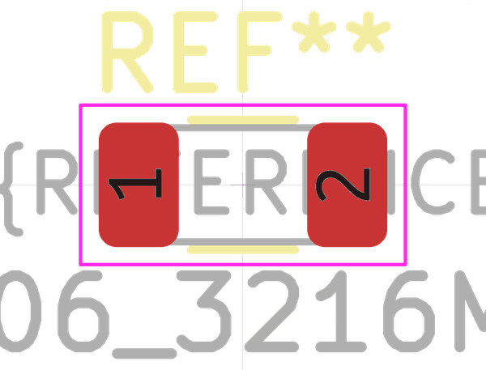

# Electronic Resistor 1206 4700000 Ohm

  
* oomp_key: oomp_electronic_resistor_1206_4700000_ohm 
* short_code: r12o475
* md5_6: d8f94c  
* github_link: https://github.com/oomlout/oomlout_oomp_part_src/tree/main/parts/electronic_resistor_1206_4700000_ohm/working  
## naming details
* classification -- electronic
* type -- resistor
* size -- 1206
* color -- 
* description_main -- 4700000_ohm
* description_extra -- 
* manucaturer -- 
* part_number -- 

## symbol

  
oomp_key: oomp_kicad_device_r  
link: https://github.com/oomlout/oomlout_oomp_symbol_bot/tree/main/symbols/kicad_device_r/working  

## footprint

  
oomp_key: oomp_kicad_resistor_smd_r_1206_3216metric  
link: https://github.com/oomlout/oomlout_oomp_footprint_bot/tree/main/footprints/kicad_resistor_smd_r_1206_3216metric/working  

## full_summary
| name | value | 
| --- | --- | 
| name | value | 
| classification | electronic | 
| type | resistor | 
| size | 1206 | 
| color |  | 
| description_main | 4700000_ohm | 
| description_extra |  | 
| manufacturer |  | 
| part_number |  | 
| filter |  | 
| kicad_reference | R | 
| id | electronic_resistor_1206_4700000_ohm | 
| id_no_class | resistor_1206_4700000_ohm | 
| id_no_type | 1206_4700000_ohm | 
| oomp_key | oomp_electronic_resistor_1206_4700000_ohm | 
| github_link | https://github.com/oomlout/oomlout_oomp_part_src/tree/main/parts/electronic_resistor_1206_4700000_ohm/working | 
| directory | parts/electronic_resistor_1206_4700000_ohm | 
| name | Electronic Resistor 1206 4700000 Ohm | 
| short_code | r12o475 | 
| short_code_upper | R12O475 | 
| distributors | [] | 
| manufacturers | [] | 
| package_style | smd_tape | 
| smd_tape_width | 8_mm | 
| smd_tape_depth | 1_5_mm | 
| smd_tape_pitch | 4_mm | 
| md5 | d8f94c95ceab77bfd6f6a8b9f4c6af21 | 
| md5_5 | d8f94 | 
| md5_5_upper | D8F94 | 
| md5_6 | d8f94c | 
| md5_6_upper | D8F94C | 
| md5_6_alpha | 8grws | 
| md5_6_alpha_upper | 8GRWS | 
| md5_10 | d8f94c95ce | 
| md5_10_upper | D8F94C95CE | 
| type_first_letter | r | 
| type_first_letter_upper | R | 
| size_only_numbers | 1206 | 
| size_only_numbers_no_zeros | 126 | 
| color_upper |  | 
| color_first_letter |  | 
| color_first_letter_upper |  | 
| description_only_numbers | 4700000 | 
| description_only_numbers_short | 4M7 | 
| description_or_color | 4M7 | 
| description_or_color_upper | 4M7 | 
| markdown_full | [electronic_resistor_1206_4700000_ohm](https://github.com/oomlout/oomlout_oomp_part_src/tree/main/parts/electronic_resistor_1206_4700000_ohm/working) [r12o475](https://github.com/oomlout/oomlout_oomp_part_src/tree/main/parts/electronic_resistor_1206_4700000_ohm/working) [Electronic Resistor 1206 4700000 Ohm](https://github.com/oomlout/oomlout_oomp_part_src/tree/main/parts/electronic_resistor_1206_4700000_ohm/working)   | 
| markdown_short | [electronic_resistor_1206_4700000_ohm](https://github.com/oomlout/oomlout_oomp_part_src/tree/main/parts/electronic_resistor_1206_4700000_ohm/working)   | 
| footprint | [{'link': 'https://github.com/oomlout/oomlout_oomp_footprint_bot/tree/main/foootprntss/kicad_resistor_smd_r_1206_3216metric', 'oomp_key': 'oomp_kicad_resistor_smd_r_1206_3216metric', 'directory': 'oomlout_oomp_footprint_bot/footprints/kicad_resistor_smd_r_1206_3216metric//working/working.kicad_mod'}] | 
| symbol | [{'link': 'https://github.com/oomlout/oomlout_oomp_symbol_bot/tree/main/symbols/kicad_device_r', 'oomp_key': 'oomp_kicad_device_r', 'directory': 'oomlout_oomp_symbol_bot/symbols/kicad_device_r//working/working.kicad_sym'}] | 
