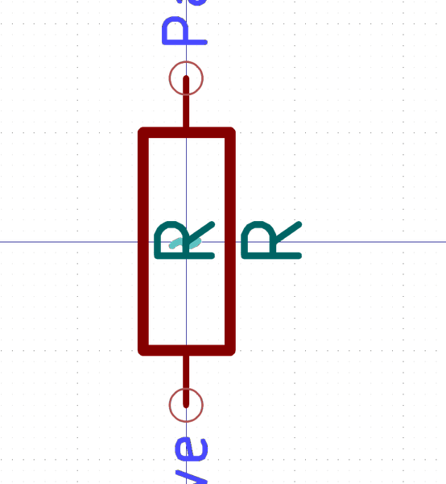

# Electronic Resistor 1206 68000 Ohm

  
* oomp_key: oomp_electronic_resistor_1206_68000_ohm 
* short_code: r12o683
* md5_6: 809313  
* github_link: https://github.com/oomlout/oomlout_oomp_part_src/tree/main/parts/electronic_resistor_1206_68000_ohm/working  
## naming details
* classification -- electronic
* type -- resistor
* size -- 1206
* color -- 
* description_main -- 68000_ohm
* description_extra -- 
* manucaturer -- 
* part_number -- 

## distributors
* [LCSC - C25668](https://lcsc.com/product-detail/C25668.html)  
* [LCSC - C137123](https://lcsc.com/product-detail/C137123.html)  

## manufacturers
* [Uniroyal - 1206W4J0683T5E]()  
* [Yageo - RC1206JR-0768KL](https://www.yageo.com/en/Chart/Download/pdf/RC1206JR-0768KL)  

## symbol

  
oomp_key: oomp_kicad_device_r  
link: https://github.com/oomlout/oomlout_oomp_symbol_bot/tree/main/symbols/kicad_device_r/working  

## footprint

  
oomp_key: oomp_kicad_resistor_smd_r_1206_3216metric  
link: https://github.com/oomlout/oomlout_oomp_footprint_bot/tree/main/footprints/kicad_resistor_smd_r_1206_3216metric/working  

## full_summary
| name | value | 
| --- | --- | 
| name | value | 
| classification | electronic | 
| type | resistor | 
| size | 1206 | 
| color |  | 
| description_main | 68000_ohm | 
| description_extra |  | 
| manufacturer |  | 
| part_number |  | 
| filter |  | 
| kicad_reference | R | 
| id | electronic_resistor_1206_68000_ohm | 
| oomp_key | oomp_electronic_resistor_1206_68000_ohm | 
| github_link | https://github.com/oomlout/oomlout_oomp_part_src/tree/main/parts/electronic_resistor_1206_68000_ohm/working | 
| directory | parts/electronic_resistor_1206_68000_ohm | 
| name | Electronic Resistor 1206 68000 Ohm | 
| short_code | r12o683 | 
| distributors | [{'name': 'LCSC', 'part_number': 'C25668', 'link': 'https://lcsc.com/product-detail/C25668.html', 'id': 'distributor_lcsc'}, {'name': 'LCSC', 'part_number': 'C137123', 'link': 'https://lcsc.com/product-detail/C137123.html', 'id': 'distributor_lcsc'}] | 
| manufacturers | [{'name': 'Uniroyal', 'part_number': '1206W4J0683T5E', 'link': '', 'id': 'manufacturer_uniroyal'}, {'name': 'Yageo', 'part_number': 'RC1206JR-0768KL', 'link': 'https://www.yageo.com/en/Chart/Download/pdf/RC1206JR-0768KL', 'id': 'manufacturer_yageo'}] | 
| md5 | 80931314dcd011ad9a1a9d12d9f9b4b6 | 
| md5_5 | 80931 | 
| md5_6 | 809313 | 
| md5_10 | 80931314dc | 
| markdown_full | [electronic_resistor_1206_68000_ohm](https://github.com/oomlout/oomlout_oomp_part_src/tree/main/parts/electronic_resistor_1206_68000_ohm/working) [r12o683](https://github.com/oomlout/oomlout_oomp_part_src/tree/main/parts/electronic_resistor_1206_68000_ohm/working) [LCSC - C25668 ](https://lcsc.com/product-detail/C25668.html)[LCSC - C137123 ](https://lcsc.com/product-detail/C137123.html) [Uniroyal - 1206W4J0683T5E]() [(L)  ](https://www.lcsc.com/search?q=1206W4J0683T5E)[(D)  ](https://www.digikey.com/en/products?,keywords=1206W4J0683T5E)[(M)  ](https://www.mouser.com/Search/Refine?Keyword=1206W4J0683T5E)[(N)  ](https://www.newark.com/search?st=1206W4J0683T5E)[(SZ)  ](https://so.szlcsc.com/global.html?k=1206W4J0683T5E) [Yageo - RC1206JR-0768KL](https://www.yageo.com/en/Chart/Download/pdf/RC1206JR-0768KL) [(L)  ](https://www.lcsc.com/search?q=RC1206JR-0768KL)[(D)  ](https://www.digikey.com/en/products?,keywords=RC1206JR-0768KL)[(M)  ](https://www.mouser.com/Search/Refine?Keyword=RC1206JR-0768KL)[(N)  ](https://www.newark.com/search?st=RC1206JR-0768KL)[(SZ)  ](https://so.szlcsc.com/global.html?k=RC1206JR-0768KL)  | 
| footprint | [{'link': 'https://github.com/oomlout/oomlout_oomp_footprint_bot/tree/main/foootprntss/kicad_resistor_smd_r_1206_3216metric', 'oomp_key': 'oomp_kicad_resistor_smd_r_1206_3216metric', 'directory': 'oomlout_oomp_footprint_bot/footprints/kicad_resistor_smd_r_1206_3216metric//working/working.kicad_mod'}] | 
| symbol | [{'link': 'https://github.com/oomlout/oomlout_oomp_symbol_bot/tree/main/symbols/kicad_device_r', 'oomp_key': 'oomp_kicad_device_r', 'directory': 'oomlout_oomp_symbol_bot/symbols/kicad_device_r//working/working.kicad_sym'}] | 
