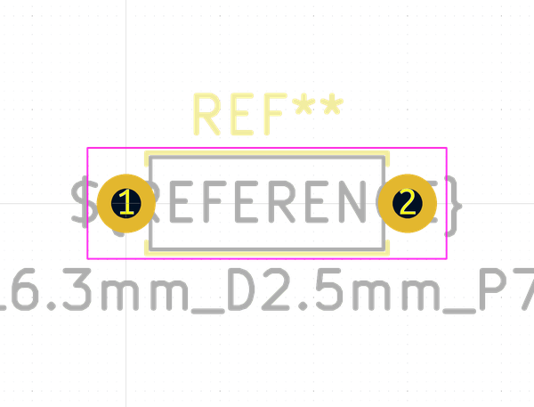

# Electronic Resistor Quarter Watt Through Hole 150 Ohm
oomp_key: oomp_electronic_resistor_quarter_watt_through_hole_150_ohm  

short_code: ro151
## naming details
* classification -- electronic
* type -- resistor
* size -- quarter_watt_through_hole
* color -- 
* description_main -- 150_ohm
* description_extra -- 
* manucaturer -- 
* part_number -- 
## pinout

List of Pins:

## symbol

oomp_key: oomp_kicad_device_r
link: https://github.com/oomlout/oomlout_oomp_symbol_bot/tree/main/symbols/kicad_device_r

## footprint

oomp_key: oomp_kicad_resistor_tht_r_axial_din0207_l6_3mm_d2_5mm_p7_62mm_horizontal
link: https://github.com/oomlout/oomlout_oomp_footprint_bot/tree/main/foootprntss/kicad_resistor_tht_r_axial_din0207_l6_3mm_d2_5mm_p7_62mm_horizontal
