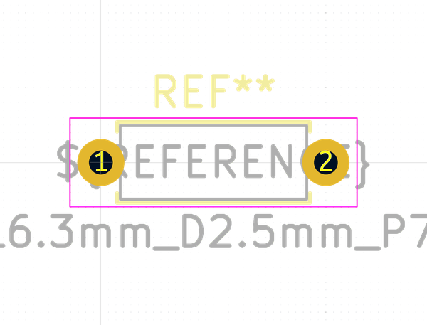

# Electronic Resistor Quarter Watt Through Hole 3300 Ohm

  
* oomp_key: oomp_electronic_resistor_quarter_watt_through_hole_3300_ohm 
* short_code: ro332
* md5_6: bb6da4  
* github_link: https://github.com/oomlout/oomlout_oomp_part_src/tree/main/parts/electronic_resistor_quarter_watt_through_hole_3300_ohm/working  
## naming details
* classification -- electronic
* type -- resistor
* size -- quarter_watt_through_hole
* color -- 
* description_main -- 3300_ohm
* description_extra -- 
* manucaturer -- 
* part_number -- 

## symbol

  
oomp_key: oomp_kicad_device_r  
link: https://github.com/oomlout/oomlout_oomp_symbol_bot/tree/main/symbols/kicad_device_r/working  

## footprint

  
oomp_key: oomp_kicad_resistor_tht_r_axial_din0207_l6_3mm_d2_5mm_p7_62mm_horizontal  
link: https://github.com/oomlout/oomlout_oomp_footprint_bot/tree/main/footprints/kicad_resistor_tht_r_axial_din0207_l6_3mm_d2_5mm_p7_62mm_horizontal/working  

## full_summary
| name | value | 
| --- | --- | 
| name | value | 
| classification | electronic | 
| type | resistor | 
| size | quarter_watt_through_hole | 
| color |  | 
| description_main | 3300_ohm | 
| description_extra |  | 
| manufacturer |  | 
| part_number |  | 
| filter |  | 
| kicad_reference | R | 
| id | electronic_resistor_quarter_watt_through_hole_3300_ohm | 
| oomp_key | oomp_electronic_resistor_quarter_watt_through_hole_3300_ohm | 
| github_link | https://github.com/oomlout/oomlout_oomp_part_src/tree/main/parts/electronic_resistor_quarter_watt_through_hole_3300_ohm/working | 
| directory | parts/electronic_resistor_quarter_watt_through_hole_3300_ohm | 
| name | Electronic Resistor Quarter Watt Through Hole 3300 Ohm | 
| short_code | ro332 | 
| distributors | [] | 
| manufacturers | [] | 
| md5 | bb6da470b1ccd507d830d71be560b84d | 
| md5_5 | bb6da | 
| md5_6 | bb6da4 | 
| md5_10 | bb6da470b1 | 
| markdown_full | [electronic_resistor_quarter_watt_through_hole_3300_ohm](https://github.com/oomlout/oomlout_oomp_part_src/tree/main/parts/electronic_resistor_quarter_watt_through_hole_3300_ohm/working) [ro332](https://github.com/oomlout/oomlout_oomp_part_src/tree/main/parts/electronic_resistor_quarter_watt_through_hole_3300_ohm/working)  | 
| footprint | [{'link': 'https://github.com/oomlout/oomlout_oomp_footprint_bot/tree/main/foootprntss/kicad_resistor_tht_r_axial_din0207_l6_3mm_d2_5mm_p7_62mm_horizontal', 'oomp_key': 'oomp_kicad_resistor_tht_r_axial_din0207_l6_3mm_d2_5mm_p7_62mm_horizontal', 'directory': 'oomlout_oomp_footprint_bot/footprints/kicad_resistor_tht_r_axial_din0207_l6_3mm_d2_5mm_p7_62mm_horizontal//working/working.kicad_mod'}] | 
| symbol | [{'link': 'https://github.com/oomlout/oomlout_oomp_symbol_bot/tree/main/symbols/kicad_device_r', 'oomp_key': 'oomp_kicad_device_r', 'directory': 'oomlout_oomp_symbol_bot/symbols/kicad_device_r//working/working.kicad_sym'}] | 
