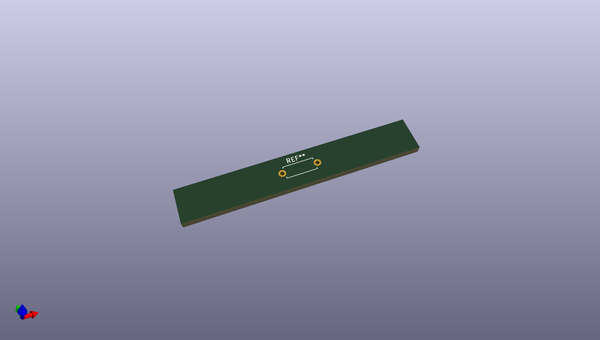

# OOMP Footprint  
## R_Axial_DIN0207_L6.3mm_D2.5mm_P7.62mm_Horizontal  by oomlout  
  
oomp key: oomp_oomlout_oomlout_oomp_part_footprints_ro475_electronic_resistor_quarter_watt_through_hole_4700000_ohm  
  
source repo at: [http://github.com/oomlout/oomlout_oomp_part_kicad_footprints/blob/master/tmp/data/oomlout_oomp_footprint_src/oomlout_oomp_part_footprints.pretty/xcr3213mhz8_electronic_ceramic_resonator_3213_3_pin_ground_pin_2_8_mega_hertz_1.kicad_mod](http://github.com/oomlout/oomlout_oomp_part_kicad_footprints/blob/master/tmp/data/oomlout_oomp_footprint_src/oomlout_oomp_part_footprints.pretty/xcr3213mhz8_electronic_ceramic_resonator_3213_3_pin_ground_pin_2_8_mega_hertz_1.kicad_mod)  
## Footprint  
  
  
  
  
| name | value | 
| --- | --- | 
| footprint name | R_Axial_DIN0207_L6.3mm_D2.5mm_P7.62mm_Horizontal | 
| footprint description | Resistor, Axial_DIN0207 series, Axial, Horizontal, pin pitch=7.62mm, 0.25W = 1/4W, length*diameter=6.3*2.5mm^2, http://cdn-reichelt.de/documents/datenblatt/B400/1_4W%23YAG.pdf | 
| number of pads | 2 | 
| github path | http://github.com/oomlout/oomlout_oomp_part_kicad_footprints/blob/master/tmp/data/oomlout_oomp_footprint_src/oomlout_oomp_part_footprints.pretty/ro475_electronic_resistor_quarter_watt_through_hole_4700000_ohm.kicad_mod | 
| oomp key | oomp_oomlout_oomlout_oomp_part_footprints_ro475_electronic_resistor_quarter_watt_through_hole_4700000_ohm | 
| oomp bot github | https://github.com/oomlout/oomlout_oomp_footprint_bot/tree/main/tmp/data/oomlout_oomp_footprint_src/footprints/oomlout_oomlout_oomp_part_footprints_ro475_electronic_resistor_quarter_watt_through_hole_4700000_ohm/working | 
## Images  
