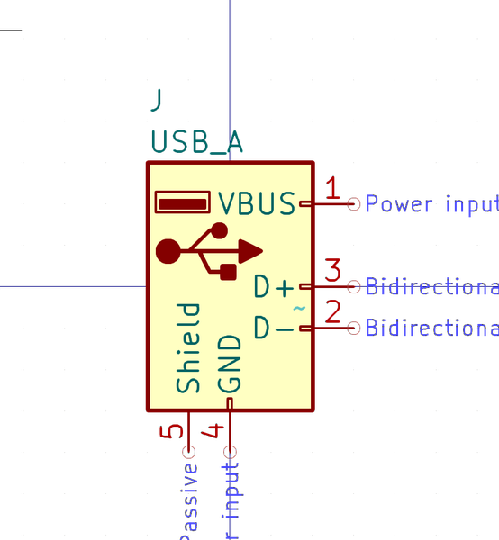
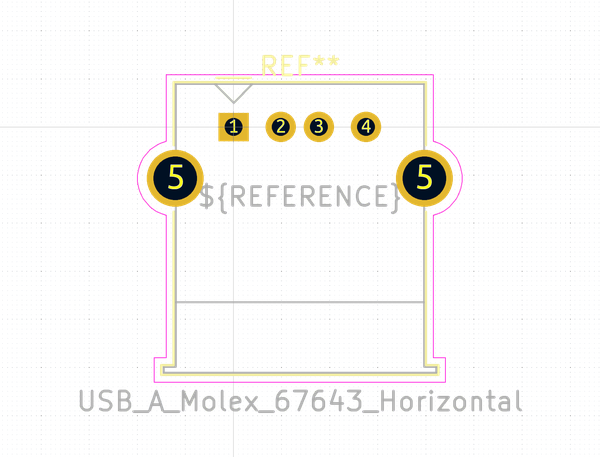

# Electronic Socket Usb A Through Hole

  
* oomp_key: oomp_electronic_socket_usb_a_through_hole 
* short_code: scuath
* md5_6: ac29a1  
* github_link: https://github.com/oomlout/oomlout_oomp_part_src/tree/main/parts/electronic_socket_usb_a_through_hole/working  
## naming details
* classification -- electronic
* type -- socket
* size -- usb_a
* color -- 
* description_main -- through_hole
* description_extra -- 
* manucaturer -- 
* part_number -- 
## pinout
  
List of Pins:

* 1 : vbus
* 2 : usb_negative
* 3 : usb_positive
* 4 : gnd
* 6 : shield

## symbol

  
oomp_key: oomp_kicad_connector_usb_a  
link: https://github.com/oomlout/oomlout_oomp_symbol_bot/tree/main/symbols/kicad_connector_usb_a/working  

## footprint

  
oomp_key: oomp_kicad_connector_usb_usb_a_molex_67643_horizontal  
link: https://github.com/oomlout/oomlout_oomp_footprint_bot/tree/main/footprints/kicad_connector_usb_usb_a_molex_67643_horizontal/working  

## full_summary
| name | value | 
| --- | --- | 
| name | value | 
| classification | electronic | 
| type | socket | 
| size | usb_a | 
| color |  | 
| description_main | through_hole | 
| description_extra |  | 
| manufacturer |  | 
| part_number |  | 
| short_name |  | 
| pins_pin_1_name | vbus | 
| pins_pin_1_number | 1 | 
| pins_pin_1_type | power | 
| pins_pin_2_name | usb_negative | 
| pins_pin_2_number | 2 | 
| pins_pin_2_type | signal | 
| pins_pin_3_name | usb_positive | 
| pins_pin_3_number | 3 | 
| pins_pin_3_type | signal | 
| pins_pin_4_name | gnd | 
| pins_pin_4_number | 4 | 
| pins_pin_4_type | signal | 
| pins_pin_5_name | shield | 
| pins_pin_5_number | 6 | 
| pins_pin_5_type | signal | 
| id | electronic_socket_usb_a_through_hole | 
| id_no_class | socket_usb_a_through_hole | 
| id_no_type | usb_a_through_hole | 
| oomp_key | oomp_electronic_socket_usb_a_through_hole | 
| github_link | https://github.com/oomlout/oomlout_oomp_part_src/tree/main/parts/electronic_socket_usb_a_through_hole/working | 
| directory | parts/electronic_socket_usb_a_through_hole | 
| name | Electronic Socket Usb A Through Hole | 
| short_code | scuath | 
| short_code_upper | SCUATH | 
| distributors | [] | 
| manufacturers | [] | 
| md5 | ac29a1c56fdd56c5fceebef01c86ea00 | 
| md5_5 | ac29a | 
| md5_6 | ac29a1 | 
| md5_10 | ac29a1c56f | 
| markdown_full | [electronic_socket_usb_a_through_hole](https://github.com/oomlout/oomlout_oomp_part_src/tree/main/parts/electronic_socket_usb_a_through_hole/working) [scuath](https://github.com/oomlout/oomlout_oomp_part_src/tree/main/parts/electronic_socket_usb_a_through_hole/working) [Electronic Socket Usb A Through Hole](https://github.com/oomlout/oomlout_oomp_part_src/tree/main/parts/electronic_socket_usb_a_through_hole/working)   | 
| markdown_short | [electronic_socket_usb_a_through_hole](https://github.com/oomlout/oomlout_oomp_part_src/tree/main/parts/electronic_socket_usb_a_through_hole/working)   | 
| footprint | [{'link': 'https://github.com/oomlout/oomlout_oomp_footprint_bot/tree/main/foootprntss/kicad_connector_usb_usb_a_molex_67643_horizontal', 'oomp_key': 'oomp_kicad_connector_usb_usb_a_molex_67643_horizontal', 'directory': 'oomlout_oomp_footprint_bot/footprints/kicad_connector_usb_usb_a_molex_67643_horizontal//working/working.kicad_mod'}] | 
| symbol | [{'link': 'https://github.com/oomlout/oomlout_oomp_symbol_bot/tree/main/symbols/kicad_connector_usb_a', 'oomp_key': 'oomp_kicad_connector_usb_a', 'directory': 'oomlout_oomp_symbol_bot/symbols/kicad_connector_usb_a//working/working.kicad_sym'}] | 
