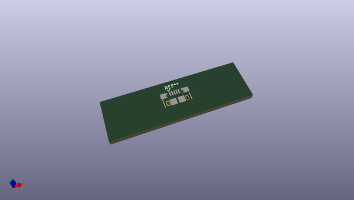
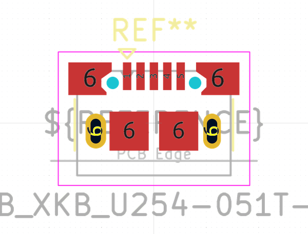
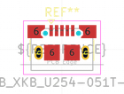
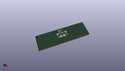

# OOMP Footprint  
## USB_Micro-B_XKB_U254-051T-4BH83-F1S  by none  
  
oomp key: oomp_kicad_connector_usb_usb_micro_b_xkb_u254_051t_4bh83_f1s  
  
source repo at: [http://gitlab.com/kicad/kicad-footprints/blob/master/tmp/data//oomlout_oomp_footprint_src/Varistor.pretty/RV_Rect_V25S440P_L26.5mm_W8.2mm_P12.7mm.kicad_mod](http://gitlab.com/kicad/kicad-footprints/blob/master/tmp/data//oomlout_oomp_footprint_src/Varistor.pretty/RV_Rect_V25S440P_L26.5mm_W8.2mm_P12.7mm.kicad_mod)  
## Footprint  
  
  
  
  
| name | value | 
| --- | --- | 
| footprint name | USB_Micro-B_XKB_U254-051T-4BH83-F1S | 
| footprint description | XKB Connectivity, USB Micro-B, right-angle, SMT, https://datasheet.lcsc.com/lcsc/2206091745_XKB-Connectivity-U254-051T-4BH83-F1S_C397452.pdf | 
| number of pads | 13 | 
| github path | http://github.com/kicad/kicad-footprints/blob/master/tmp/data//oomlout_oomp_footprint_src/Connector_USB.pretty/USB_Micro-B_XKB_U254-051T-4BH83-F1S.kicad_mod | 
| oomp key | oomp_kicad_connector_usb_usb_micro_b_xkb_u254_051t_4bh83_f1s | 
| oomp bot github | https://github.com/oomlout/oomlout_oomp_footprint_bot/tree/main/tmp/data//oomlout_oomp_footprint_src/footprints/kicad_connector_usb_usb_micro_b_xkb_u254_051t_4bh83_f1s/working | 
## Images  
  
  
  
  
  
  
  
  
