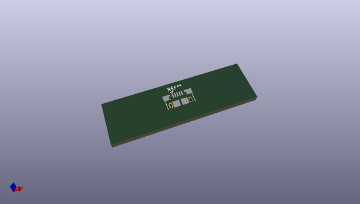
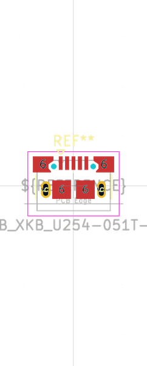

# OOMP Footprint  
## USB_Micro-B_XKB_U254-051T-4BH83-F1S  by oomlout  
  
oomp key: oomp_oomlout_oomlout_oomp_part_footprints_scumcsm_electronic_socket_usb_micro_surface_mount  
  
source repo at: [http://github.com/oomlout/oomlout_oomp_part_kicad_footprints/blob/master/tmp/data/oomlout_oomp_footprint_src/oomlout_oomp_part_footprints.pretty/xcr3213mhz8_electronic_ceramic_resonator_3213_3_pin_ground_pin_2_8_mega_hertz_1.kicad_mod](http://github.com/oomlout/oomlout_oomp_part_kicad_footprints/blob/master/tmp/data/oomlout_oomp_footprint_src/oomlout_oomp_part_footprints.pretty/xcr3213mhz8_electronic_ceramic_resonator_3213_3_pin_ground_pin_2_8_mega_hertz_1.kicad_mod)  
## Footprint  
  
  
  
  
| name | value | 
| --- | --- | 
| footprint name | USB_Micro-B_XKB_U254-051T-4BH83-F1S | 
| footprint description | XKB Connectivity, USB Micro-B, right-angle, SMT, https://datasheet.lcsc.com/lcsc/2206091745_XKB-Connectivity-U254-051T-4BH83-F1S_C397452.pdf | 
| number of pads | 13 | 
| github path | http://github.com/oomlout/oomlout_oomp_part_kicad_footprints/blob/master/tmp/data/oomlout_oomp_footprint_src/oomlout_oomp_part_footprints.pretty/scumcsm_electronic_socket_usb_micro_surface_mount.kicad_mod | 
| oomp key | oomp_oomlout_oomlout_oomp_part_footprints_scumcsm_electronic_socket_usb_micro_surface_mount | 
| oomp bot github | https://github.com/oomlout/oomlout_oomp_footprint_bot/tree/main/tmp/data/oomlout_oomp_footprint_src/footprints/oomlout_oomlout_oomp_part_footprints_scumcsm_electronic_socket_usb_micro_surface_mount/working | 
## Images  
