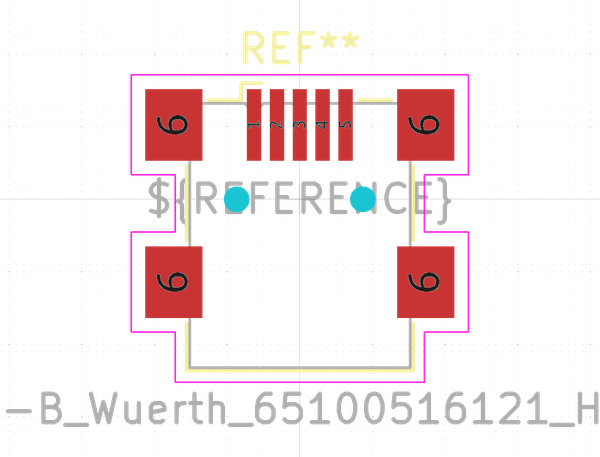

# OOMP Footprint  
## USB_Mini-B_Wuerth_65100516121_Horizontal  by none  
  
oomp key: oomp_kicad_connector_usb_usb_mini_b_wuerth_65100516121_horizontal  
  
source repo at: [http://gitlab.com/kicad/libraries/kicad-footprints//blob/master/tmp/libraries/kicad-footprints/Varistor.pretty/RV_Rect_V25S440P_L26.5mm_W8.2mm_P12.7mm.kicad_mod](http://gitlab.com/kicad/libraries/kicad-footprints//blob/master/tmp/libraries/kicad-footprints/Varistor.pretty/RV_Rect_V25S440P_L26.5mm_W8.2mm_P12.7mm.kicad_mod)  
## Footprint  
  
  
  
  
| name | value | 
| --- | --- | 
| footprint name | USB_Mini-B_Wuerth_65100516121_Horizontal | 
| footprint description | Mini USB 2.0 Type B SMT Horizontal 5 Contacts (https://katalog.we-online.de/em/datasheet/65100516121.pdf) | 
| number of pads | 11 | 
| github path | http://github.com/kicad/libraries/kicad-footprints//blob/master/tmp/libraries/kicad-footprints/Connector_USB.pretty/USB_Mini-B_Wuerth_65100516121_Horizontal.kicad_mod | 
| oomp key | oomp_kicad_connector_usb_usb_mini_b_wuerth_65100516121_horizontal | 
| oomp bot github | https://github.com/oomlout/oomlout_oomp_footprint_bot/tree/main/footprints/kicad_connector_usb_usb_mini_b_wuerth_65100516121_horizontal/working | 
## Images  
