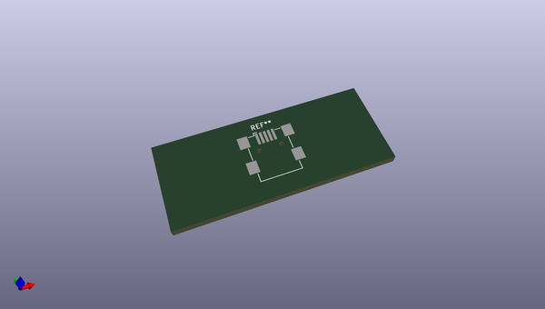
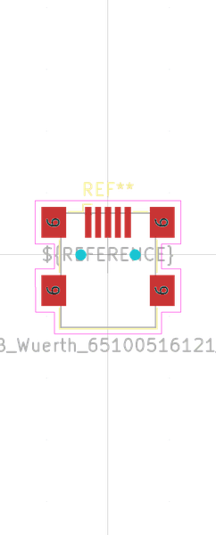

# OOMP Footprint  
## USB_Mini-B_Wuerth_65100516121_Horizontal  by oomlout  
  
oomp key: oomp_oomlout_oomlout_oomp_part_footprints_scumnsmo_electronic_socket_usb_mini_surface_mount_only  
  
source repo at: [http://github.com/oomlout/oomlout_oomp_part_kicad_footprints/blob/master/tmp/data/oomlout_oomp_footprint_src/oomlout_oomp_part_footprints.pretty/xcr3213mhz8_electronic_ceramic_resonator_3213_3_pin_ground_pin_2_8_mega_hertz_1.kicad_mod](http://github.com/oomlout/oomlout_oomp_part_kicad_footprints/blob/master/tmp/data/oomlout_oomp_footprint_src/oomlout_oomp_part_footprints.pretty/xcr3213mhz8_electronic_ceramic_resonator_3213_3_pin_ground_pin_2_8_mega_hertz_1.kicad_mod)  
## Footprint  
  
  
  
  
| name | value | 
| --- | --- | 
| footprint name | USB_Mini-B_Wuerth_65100516121_Horizontal | 
| footprint description | Mini USB 2.0 Type B SMT Horizontal 5 Contacts (https://katalog.we-online.de/em/datasheet/65100516121.pdf) | 
| number of pads | 11 | 
| github path | http://github.com/oomlout/oomlout_oomp_part_kicad_footprints/blob/master/tmp/data/oomlout_oomp_footprint_src/oomlout_oomp_part_footprints.pretty/scumnsmo_electronic_socket_usb_mini_surface_mount_only.kicad_mod | 
| oomp key | oomp_oomlout_oomlout_oomp_part_footprints_scumnsmo_electronic_socket_usb_mini_surface_mount_only | 
| oomp bot github | https://github.com/oomlout/oomlout_oomp_footprint_bot/tree/main/tmp/data/oomlout_oomp_footprint_src/footprints/oomlout_oomlout_oomp_part_footprints_scumnsmo_electronic_socket_usb_mini_surface_mount_only/working | 
## Images  
