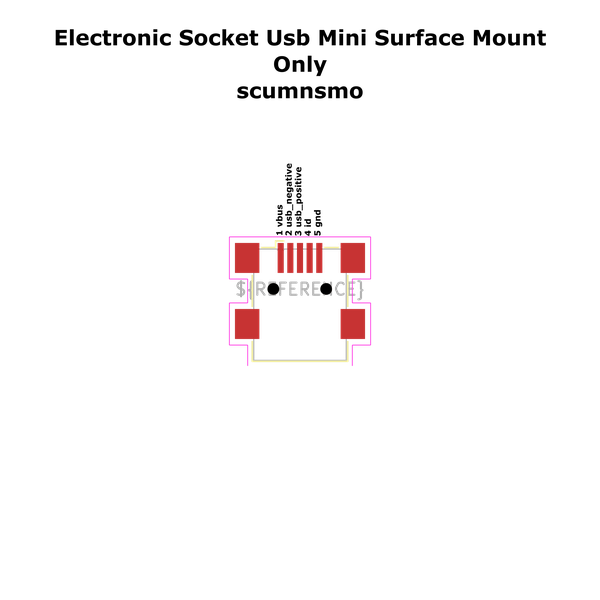

# Electronic Socket Usb Mini Surface Mount Only

  
* oomp_key: oomp_electronic_socket_usb_mini_surface_mount_only 
* short_code: scumnsmo
* md5_6: 34c5c0  
* github_link: https://github.com/oomlout/oomlout_oomp_part_src/tree/main/parts/electronic_socket_usb_mini_surface_mount_only/working  
## naming details
* classification -- electronic
* type -- socket
* size -- usb_mini
* color -- 
* description_main -- surface_mount_only
* description_extra -- 
* manucaturer -- 
* part_number -- 
## pinout
  
List of Pins:

* 1 : vbus
* 2 : usb_negative
* 3 : usb_positive
* 4 : id
* 5 : gnd
* 6 : shield
## distributors
* [LCSC - C91144](https://lcsc.com/product-detail/C91144.html)  
* [LCSC - C91144](https://lcsc.com/product-detail/C91144.html)  

## manufacturers
* [Korean Hroparts Elec - U-M-M5SS-W-2]()  

## symbol

  
oomp_key: oomp_kicad_connector_usb_b_mini  
link: https://github.com/oomlout/oomlout_oomp_symbol_bot/tree/main/symbols/kicad_connector_usb_b_mini/working  

## footprint

  
oomp_key: oomp_kicad_connector_usb_usb_mini_b_wuerth_65100516121_horizontal  
link: https://github.com/oomlout/oomlout_oomp_footprint_bot/tree/main/footprints/kicad_connector_usb_usb_mini_b_wuerth_65100516121_horizontal/working  

## full_summary
| name | value | 
| --- | --- | 
| name | value | 
| classification | electronic | 
| type | socket | 
| size | usb_mini | 
| color |  | 
| description_main | surface_mount_only | 
| description_extra |  | 
| manufacturer |  | 
| part_number |  | 
| short_name |  | 
| pins_pin_1_name | vbus | 
| pins_pin_1_number | 1 | 
| pins_pin_1_type | power | 
| pins_pin_2_name | usb_negative | 
| pins_pin_2_number | 2 | 
| pins_pin_2_type | signal | 
| pins_pin_3_name | usb_positive | 
| pins_pin_3_number | 3 | 
| pins_pin_3_type | signal | 
| pins_pin_4_name | id | 
| pins_pin_4_number | 4 | 
| pins_pin_4_type | signal | 
| pins_pin_5_name | gnd | 
| pins_pin_5_number | 5 | 
| pins_pin_5_type | power | 
| pins_pin_6_name | shield | 
| pins_pin_6_number | 6 | 
| pins_pin_6_type | signal | 
| id | electronic_socket_usb_mini_surface_mount_only | 
| oomp_key | oomp_electronic_socket_usb_mini_surface_mount_only | 
| github_link | https://github.com/oomlout/oomlout_oomp_part_src/tree/main/parts/electronic_socket_usb_mini_surface_mount_only/working | 
| directory | parts/electronic_socket_usb_mini_surface_mount_only | 
| name | Electronic Socket Usb Mini Surface Mount Only | 
| short_code | scumnsmo | 
| distributors | [{'name': 'LCSC', 'part_number': 'C91144', 'link': 'https://lcsc.com/product-detail/C91144.html', 'id': 'distributor_lcsc'}, {'name': 'LCSC', 'part_number': 'C91144', 'link': 'https://lcsc.com/product-detail/C91144.html', 'id': 'distributor_lcsc'}] | 
| manufacturers | [{'name': 'Korean Hroparts Elec', 'part_number': 'U-M-M5SS-W-2', 'link': '', 'id': 'manufacturer_korean_hroparts_elec'}] | 
| md5 | 34c5c0be3324508572b94f980c1c9606 | 
| md5_5 | 34c5c | 
| md5_6 | 34c5c0 | 
| md5_10 | 34c5c0be33 | 
| markdown_full | [electronic_socket_usb_mini_surface_mount_only](https://github.com/oomlout/oomlout_oomp_part_src/tree/main/parts/electronic_socket_usb_mini_surface_mount_only/working) [scumnsmo](https://github.com/oomlout/oomlout_oomp_part_src/tree/main/parts/electronic_socket_usb_mini_surface_mount_only/working) [LCSC - C91144 ](https://lcsc.com/product-detail/C91144.html)[LCSC - C91144 ](https://lcsc.com/product-detail/C91144.html) [Korean Hroparts Elec - U-M-M5SS-W-2]() [(L)  ](https://www.lcsc.com/search?q=U-M-M5SS-W-2)[(D)  ](https://www.digikey.com/en/products?,keywords=U-M-M5SS-W-2)[(M)  ](https://www.mouser.com/Search/Refine?Keyword=U-M-M5SS-W-2)[(N)  ](https://www.newark.com/search?st=U-M-M5SS-W-2)[(SZ)  ](https://so.szlcsc.com/global.html?k=U-M-M5SS-W-2)  | 
| footprint | [{'link': 'https://github.com/oomlout/oomlout_oomp_footprint_bot/tree/main/foootprntss/kicad_connector_usb_usb_mini_b_wuerth_65100516121_horizontal', 'oomp_key': 'oomp_kicad_connector_usb_usb_mini_b_wuerth_65100516121_horizontal', 'directory': 'oomlout_oomp_footprint_bot/footprints/kicad_connector_usb_usb_mini_b_wuerth_65100516121_horizontal//working/working.kicad_mod'}] | 
| symbol | [{'link': 'https://github.com/oomlout/oomlout_oomp_symbol_bot/tree/main/symbols/kicad_connector_usb_b_mini', 'oomp_key': 'oomp_kicad_connector_usb_b_mini', 'directory': 'oomlout_oomp_symbol_bot/symbols/kicad_connector_usb_b_mini//working/working.kicad_sym'}] | 
