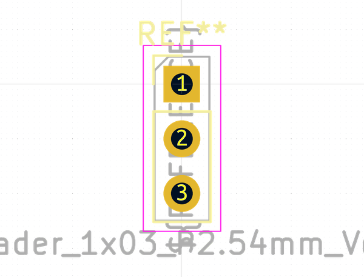

# Electronic Switch Slide 2D54 Header Surface Mount Single Pole Double Throw

  
* oomp_key: oomp_electronic_switch_slide_2d54_header_surface_mount_single_pole_double_throw 
* short_code: swsi1hs
* md5_6: 3c040b  
* github_link: https://github.com/oomlout/oomlout_oomp_part_src/tree/main/parts/electronic_switch_slide_2d54_header_surface_mount_single_pole_double_throw/working  
## naming details
* classification -- electronic
* type -- switch_slide
* size -- 2d54_header
* color -- surface_mount
* description_main -- single_pole_double_throw
* description_extra -- 
* manucaturer -- 
* part_number -- 

## symbol

  
oomp_key: oomp_kicad_switch_sw_spdt  
link: https://github.com/oomlout/oomlout_oomp_symbol_bot/tree/main/symbols/kicad_switch_sw_spdt/working  

## footprint

  
oomp_key: oomp_kicad_connector_pinheader_2_54mm_pinheader_1x03_p2_54mm_vertical  
link: https://github.com/oomlout/oomlout_oomp_footprint_bot/tree/main/footprints/kicad_connector_pinheader_2_54mm_pinheader_1x03_p2_54mm_vertical/working  

## full_summary
| name | value | 
| --- | --- | 
| name | value | 
| classification | electronic | 
| type | switch_slide | 
| size | 2d54_header | 
| color | surface_mount | 
| description_main | single_pole_double_throw | 
| description_extra |  | 
| manufacturer |  | 
| part_number |  | 
| short_name |  | 
| distributors | [] | 
| id | electronic_switch_slide_2d54_header_surface_mount_single_pole_double_throw | 
| id_no_class | switch_slide_2d54_header_surface_mount_single_pole_double_throw | 
| id_no_type | 2d54_header_surface_mount_single_pole_double_throw | 
| oomp_key | oomp_electronic_switch_slide_2d54_header_surface_mount_single_pole_double_throw | 
| github_link | https://github.com/oomlout/oomlout_oomp_part_src/tree/main/parts/electronic_switch_slide_2d54_header_surface_mount_single_pole_double_throw/working | 
| directory | parts/electronic_switch_slide_2d54_header_surface_mount_single_pole_double_throw | 
| name | Electronic Switch Slide 2D54 Header Surface Mount Single Pole Double Throw | 
| short_code | swsi1hs | 
| short_code_upper | SWSI1HS | 
| manufacturers | [] | 
| md5 | 3c040b7cc81dbfc3001df6919b5c4b0c | 
| md5_5 | 3c040 | 
| md5_5_upper | 3C040 | 
| md5_6 | 3c040b | 
| md5_6_upper | 3C040B | 
| md5_10 | 3c040b7cc8 | 
| md5_10_upper | 3C040B7CC8 | 
| type_first_letter | s | 
| type_first_letter_upper | S | 
| size_only_numbers | 254 | 
| size_only_numbers_no_zeros | 254 | 
| color_upper | SURFACE_MOUNT | 
| color_first_letter | s | 
| color_first_letter_upper | S | 
| description_only_numbers |  | 
| description_only_numbers_short |   | 
| description_or_color | s  | 
| description_or_color_upper | S  | 
| markdown_full | [electronic_switch_slide_2d54_header_surface_mount_single_pole_double_throw](https://github.com/oomlout/oomlout_oomp_part_src/tree/main/parts/electronic_switch_slide_2d54_header_surface_mount_single_pole_double_throw/working) [swsi1hs](https://github.com/oomlout/oomlout_oomp_part_src/tree/main/parts/electronic_switch_slide_2d54_header_surface_mount_single_pole_double_throw/working) [Electronic Switch Slide 2D54 Header Surface Mount Single Pole Double Throw](https://github.com/oomlout/oomlout_oomp_part_src/tree/main/parts/electronic_switch_slide_2d54_header_surface_mount_single_pole_double_throw/working)   | 
| markdown_short | [electronic_switch_slide_2d54_header_surface_mount_single_pole_double_throw](https://github.com/oomlout/oomlout_oomp_part_src/tree/main/parts/electronic_switch_slide_2d54_header_surface_mount_single_pole_double_throw/working)   | 
| footprint | [{'link': 'https://github.com/oomlout/oomlout_oomp_footprint_bot/tree/main/foootprntss/kicad_connector_pinheader_2_54mm_pinheader_1x03_p2_54mm_vertical', 'oomp_key': 'oomp_kicad_connector_pinheader_2_54mm_pinheader_1x03_p2_54mm_vertical', 'directory': 'oomlout_oomp_footprint_bot/footprints/kicad_connector_pinheader_2_54mm_pinheader_1x03_p2_54mm_vertical//working/working.kicad_mod'}] | 
| symbol | [{'link': 'https://github.com/oomlout/oomlout_oomp_symbol_bot/tree/main/symbols/kicad_switch_sw_spdt', 'oomp_key': 'oomp_kicad_switch_sw_spdt', 'directory': 'oomlout_oomp_symbol_bot/symbols/kicad_switch_sw_spdt//working/working.kicad_sym'}] | 
